:header_title: Set-up Root Certificate Authority
:header_subtitle: Step-by-step guide how to generate a basic root certificate authority.


Create Root Certificate Authority
=================================

This document will show you how to set up a root certificate authority with BounCA.
We assume you have just installed BounCA, created an account, and are logged in on the desktop.

---------------------------------

Generate Root Certificate
~~~~~~~~~~~~~~~~~~~~~~~~~

Acting as a certificate authority (CA) means dealing with cryptographic pairs of private keys and public certificates. 
The very first cryptographic pair we will create is the root pair. 
This consists of the root key (``ca.key.pem``) and root certificate (``ca.cert.pem``). 
This pair forms the identity of your CA.
Within BounCA the key will not available in the web user interface, the root certificate is available after you have generated the pair for installation on clients.

Typically, the root CA does not sign server or client certificates directly. 
The root CA is only ever used to create one or more intermediate certificate authorities, which are trusted by the root CA to sign certificates on their behalf.
This is best practice. 
It allows the root key to be kept offline and unused as much as possible, as any compromise of the root key is disastrous.

When you login to your fresh BounCA installation, you will see an empty dashboard.
You should first generate a root certificate, please push the *tower* button. 


    Start screen of BounCA without a root authority
    
After clicking on the *tower* button a new modal view will appear. Please enter the details of your Root Certificate. Most important is the common name, which should be unique in your key setup. Also make sure the company info is correct, as you cannot edit it aftwards. Also configure your OCSP and CRL usrl for the revocation services.

Give the root certificate a long expiry date, such as twenty years. Once the root certificate expires, all certificates signed by the CA become invalid.

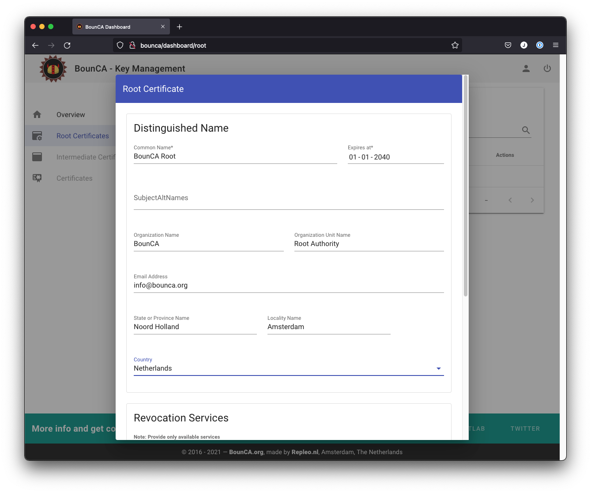

    Create root certificate

You will see the passphrases when you scroll down. Create a passphrase for accessing your key. Remember your passphrase or store it in a realy save place like a safe.    

The root key will be encrypted by BounCA with AES 256-bit encryption and use a strong passphrase to protect it as it is the core of your trust chain.

.. note:: BounCA uses 4096 bits for all root and intermediate certificate authority keys. 
          
          
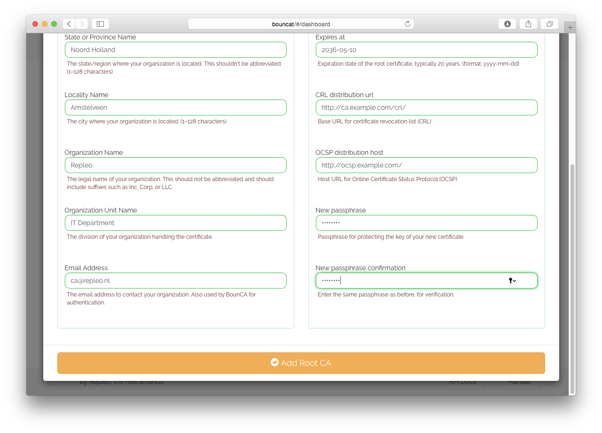

    Enter passphrase of root certificate
    
Your CA certificate will be generated if all date is complete and correct. 


    
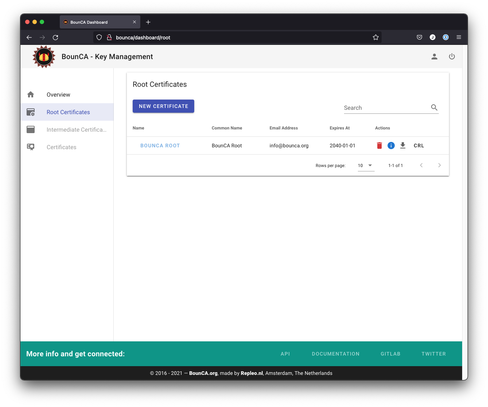

    Root certificate for authority generated
    
You can check the subject and data of the certifcate by clicking on the info button.

The output shows:

- the ``Signature Algorithm`` used
- the dates of certificate ``Validity``
- the ``Public-Key`` bit length
- the ``Issuer``, which is the entity that signed the certificate
- the ``Subject``, which refers to the certificate itself

The ``Issuer`` and ``Subject`` are identical as the certificate is self-signed. 
Note that all root certificates are self-signed.


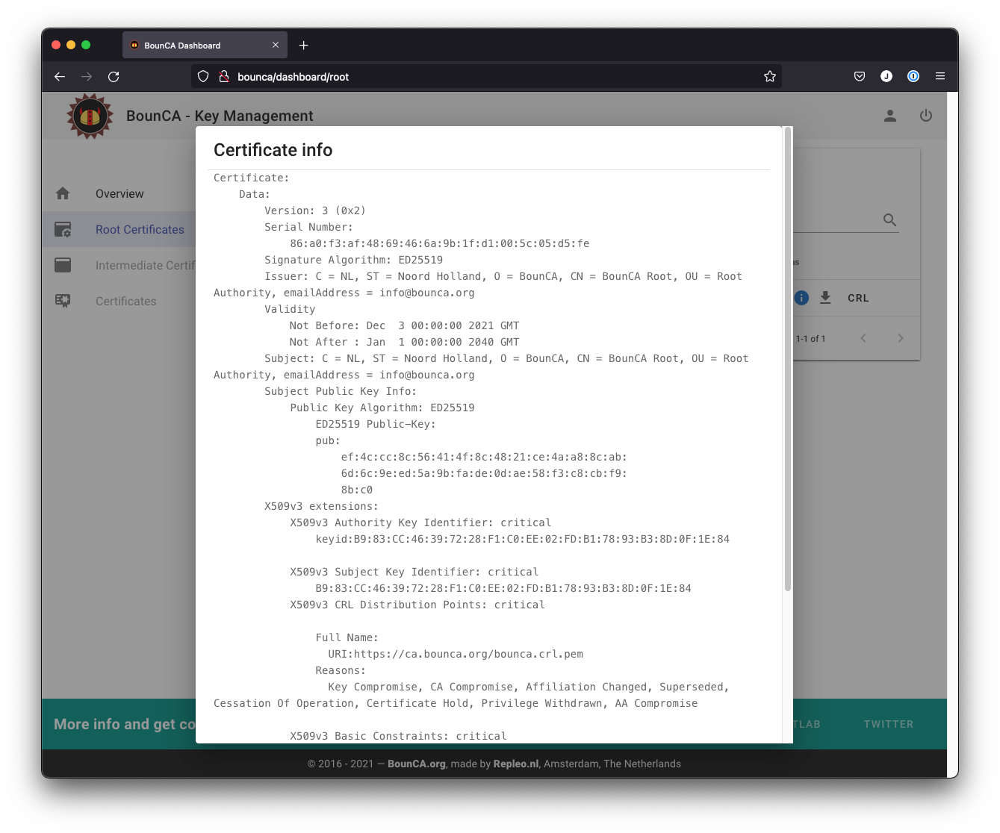

    Inspect root certificate

And you can check if the OCSP and/or CRL links are avaiable in the X.509v3 fields of the certificate.
The output also shows the *X509v3 extensions* as we applied them. 

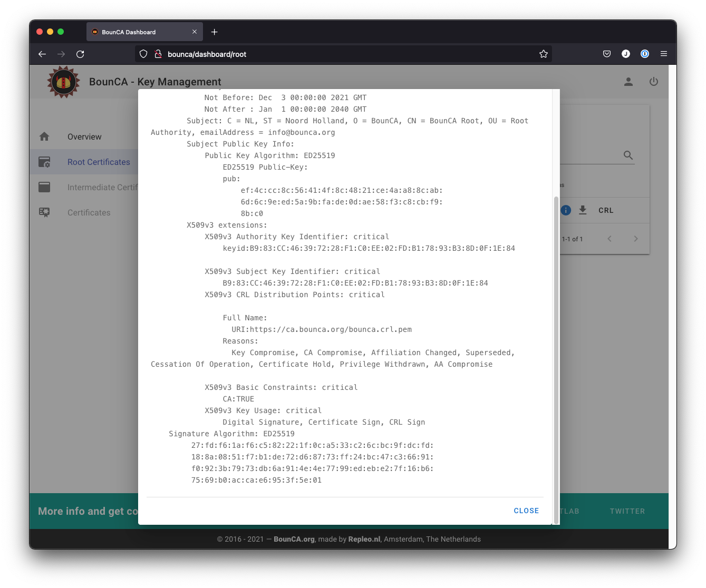

    Inspect revocation services CRL and OCSP links in certificate
    
Install your root certificate authority
~~~~~~~~~~~~~~~~~~~~~~~~~~~~~~~~~~~~~~~

You can download the root certificate PEM by clicking on the ``download`` button.
The PEM file can be used to add your root authority to the trust library of your operating system

Mac OS X
````````

Double click on the downloaded PEM. The key manager programm will start and it will show you the certificate.
Check the validity of the certificate.


.. figure:: ../images/generate-server-certificate/20-install-root-pem-certificate.png
    :width: 800px
    :align: center
    :alt: Install root CA pem file OS X
    :figclass: align-center

    Install root CA pem file on OS X


.. figure:: ../images/generate-server-certificate/21-validate-root-ca-pem.png
    :height: 500px
    :align: center
    :alt: Validate root CA pem on OS X
    :figclass: align-center

    Validate root CA PEM on OS X

In case you trust the certificate you can add it to your operating system. Add it on system level, OS X will ask for your administrator password.
When you have added the certificate to your trust chain, OS X will trust the root CA's signed certificates.


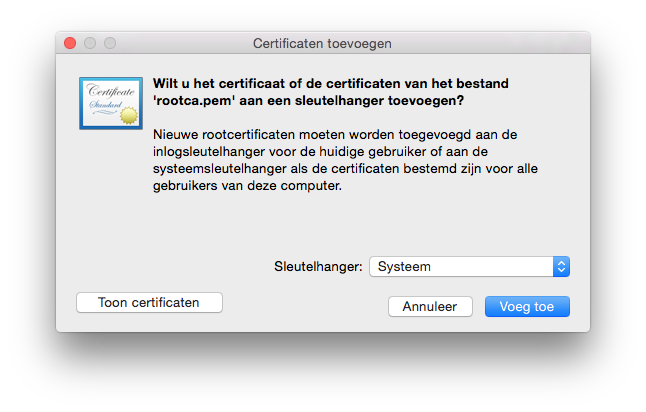

    Add root CA PEM to OS X

Enter your administator password.

.. figure:: ../images/generate-server-certificate/23-enter-password.png
    :height: 350px
    :align: center
    :alt: Enter administrator password
    :figclass: align-center

    Enter your administrator password

Add the root authority pem as trusted root certificate to your system.

.. figure:: ../images/generate-server-certificate/24-trust-self-signed-root-ca-pem.png
    :height: 500px
    :align: center
    :alt: Trust added root authority pem
    :figclass: align-center

    Trust added root authority PEM

Enable system-wide trust of your root certificate

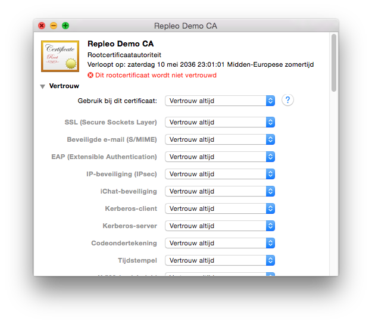

    Trust rules enabled

Re-open the root PEM certificate in the key manager. You will notice it is now trusted by OS X.

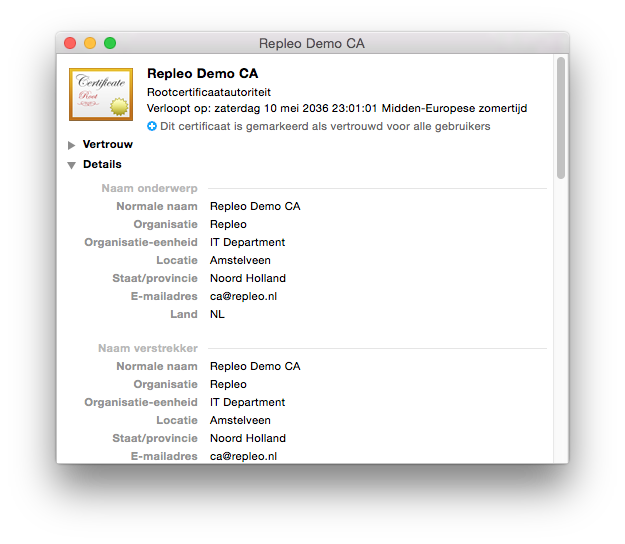

    Verify root CA has been trusted
    
    
Generate the intermediate certificate authority
~~~~~~~~~~~~~~~~~~~~~~~~~~~~~~~~~~~~~~~~~~~~~~~

An intermediate certificate authority (CA) is an entity that can sign certificates on behalf of the root CA. 
The root CA signs the intermediate certificate, forming a chain of trust.

The purpose of using an intermediate CA is primarily for security. 
The root key can be kept offline and used as infrequently as possible. 
If the intermediate key is compromised, the root CA can revoke the intermediate certificate and create a new intermediate cryptographic pair.

Enter the root CA view in BounCA by clicking on the blue ``edit`` button or by clicking on the shortname of the root certificate.
You will enter a screen with an empty table.

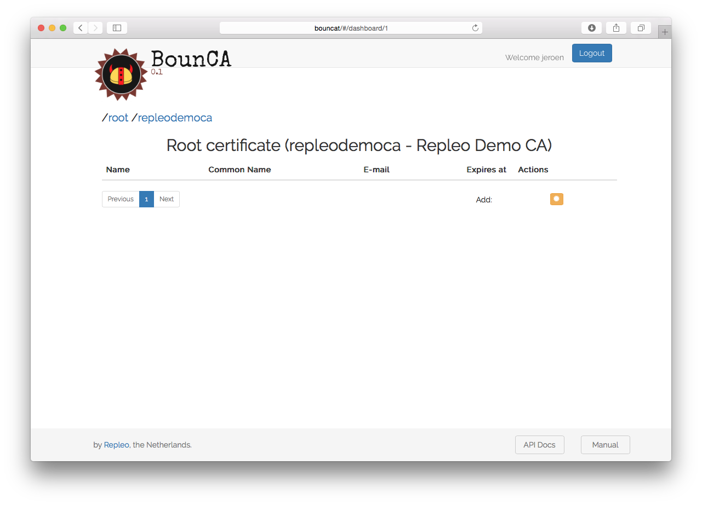

    Use root certificate as context
    
Click on the yellow add intermediate root certificate button. You will get a form where you can fill in the details of your intermediate CA. 
Give the intermediate CA a common name which distinguish from the root certificate.
You will not be able to edit all the fields, as they must be the same as of your root authority.

The intermediate certificate should be valid for a shorter period than the root certificate. 
Ten years would be reasonable.

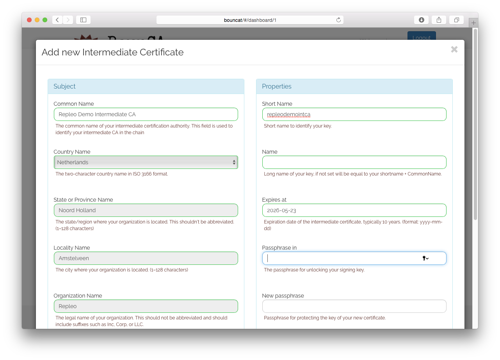

    Generate intermediate certificate authority

Enter the passphrase of the root certificate to be able to sign the intermediate certificate and enter the passphrase of the certificate self.
Use again a strong passphrase to protect your intermediate certificate.

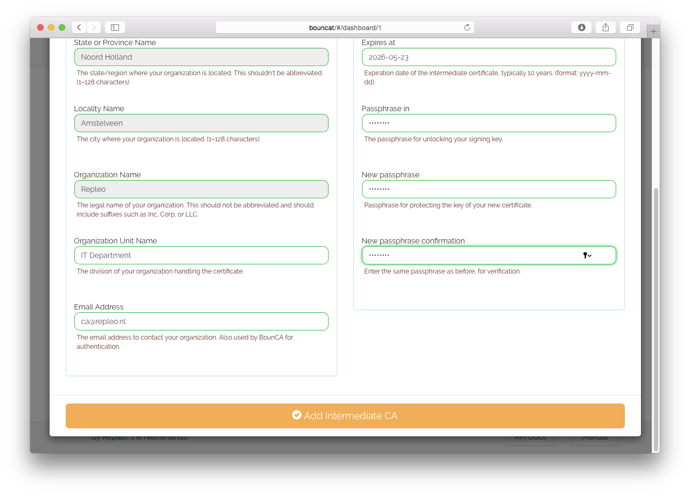

    Enter passphrases for generating intermediate certificate

The intermediate certificate will be generated and you can inspect its subject by clicking on the ``info`` button.

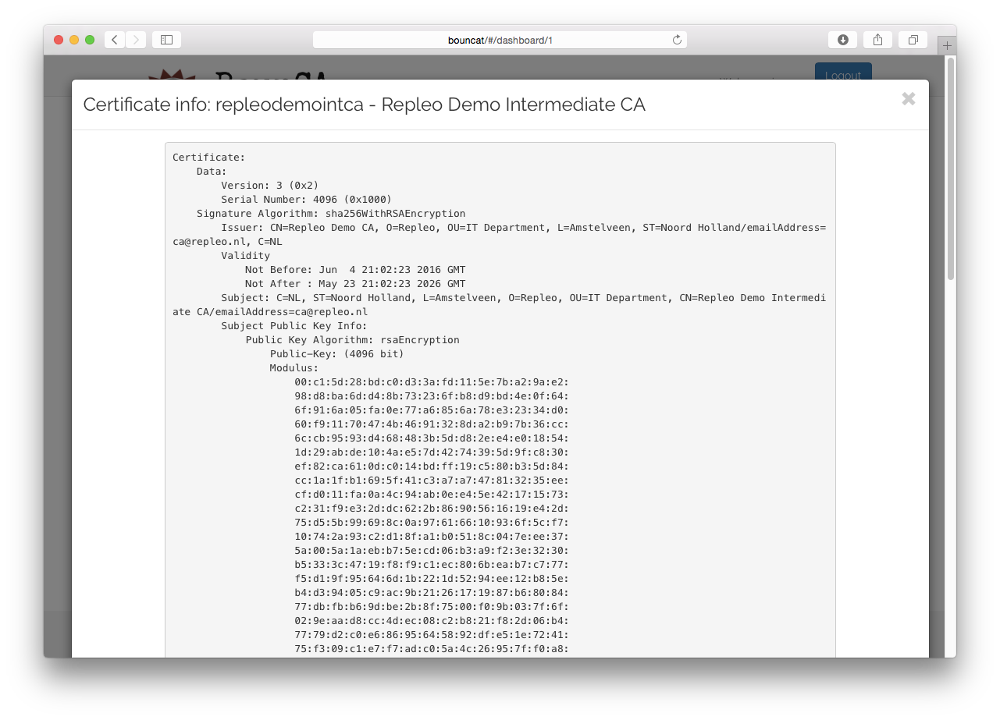

    Inspect intermediate certificate authority

The CRL and OCSP urls are automatically assigned to the same as the root certificate, and in case of the CRL url, it refers to the name of your intermediate authority.

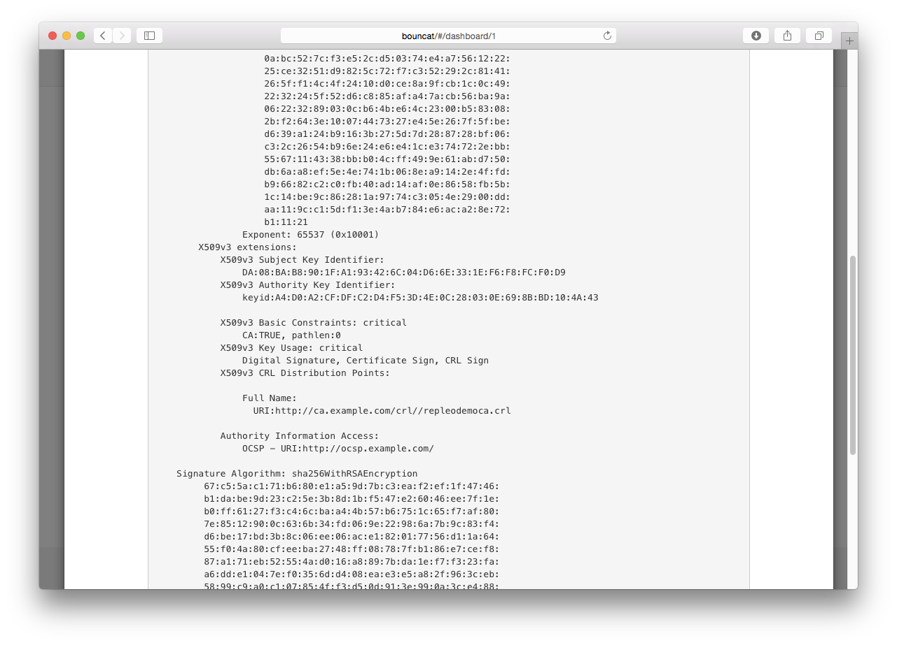

    Inspect CRL and OCSP links of intermediate certificat
    
This guide has shown you how to setup a root certificate authority with BounCA and how to generate an intermediate certificate.
You can now generate server and client certificates to enable encrypted HTTPS connections and client authorisation. 

  
