:header_title: Self-Signed Client Certificate
:header_subtitle: Step-by-step guide to set up mutual TLS using client certificates.

.. _create_client_certificates:

Setting up mutual TLS using Client Certificates
===============================================

This document will show you can generate a client certificate with BounCA.
We assume you have a working BounCA and create a certificate authority, see :ref:`create_root_certificate`.

---------------------------------

Generate Client Certificate
~~~~~~~~~~~~~~~~~~~~~~~~~~~

Client certificates can be used to authenticate HTTP sessions, automatic login to web applications, and to sign/encrypt e-mails.
Password credentials are not necessary when using client certificate. This is useful when authenticating or provisioning
Internet of Things devices to an API. The devices don not store user credentials, and all authentication is offloaded to the SSL layer.
CRL or OCSP can be used to revoke access by revoking the certificate.
In case the common name and/or subject alternative names field contain an email-address. The mail client will be able to sign your e-mail messages, see :ref:`create_mail_certificate`.

Enter the dashboard of your intermediate CA which must sign your client certificate.

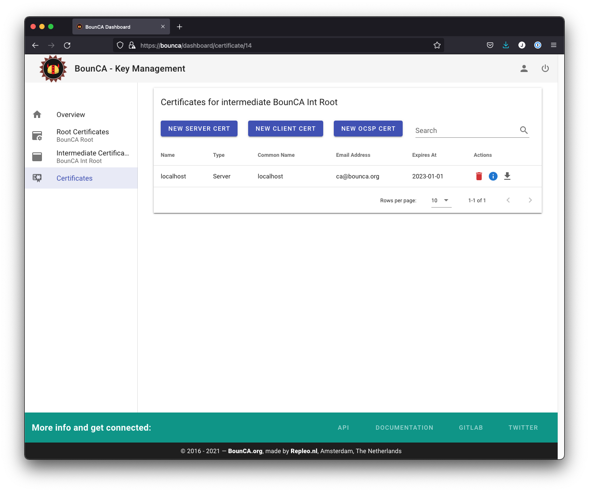

    Step into intermediate certificate

Click on the *New Client Cert* button to add a new client certificate, and a form will be shown.
For client certificates, the *Common Name* is your user name, or e-mail address. For mail signing certificates, you also need to add the e-mail address to the SubjectAltNames.

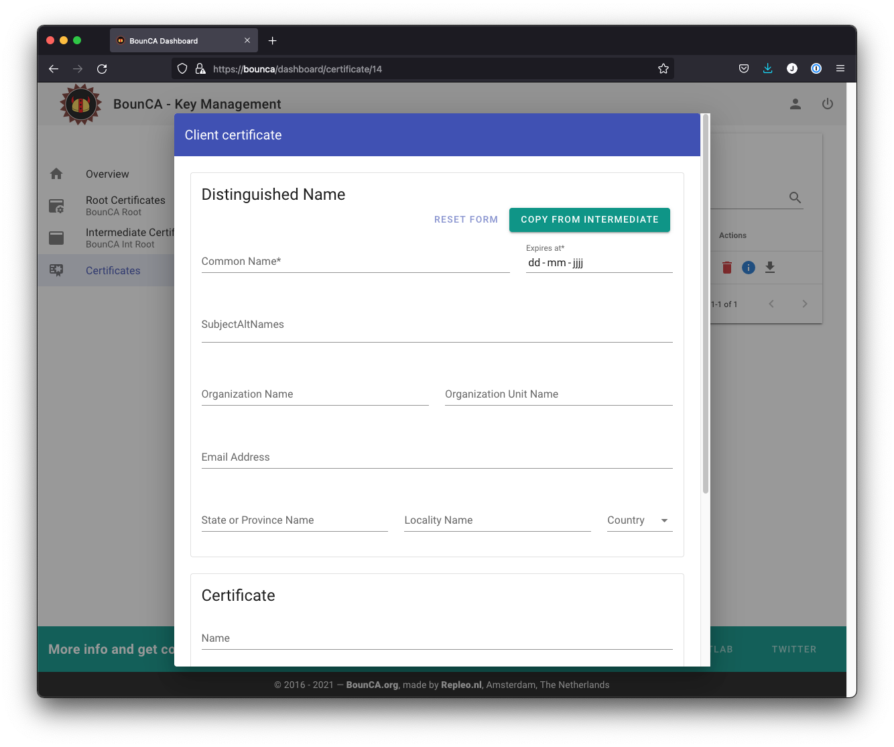

    Empty client certificate create form

Fill in the data for your client certificate. We use the *Copy From Intermediate* button to fill in the base information.
Certificates are usually given a validity of one year, though a CA will typically give a few days extra for convenience.

    Fill in the data for demo1

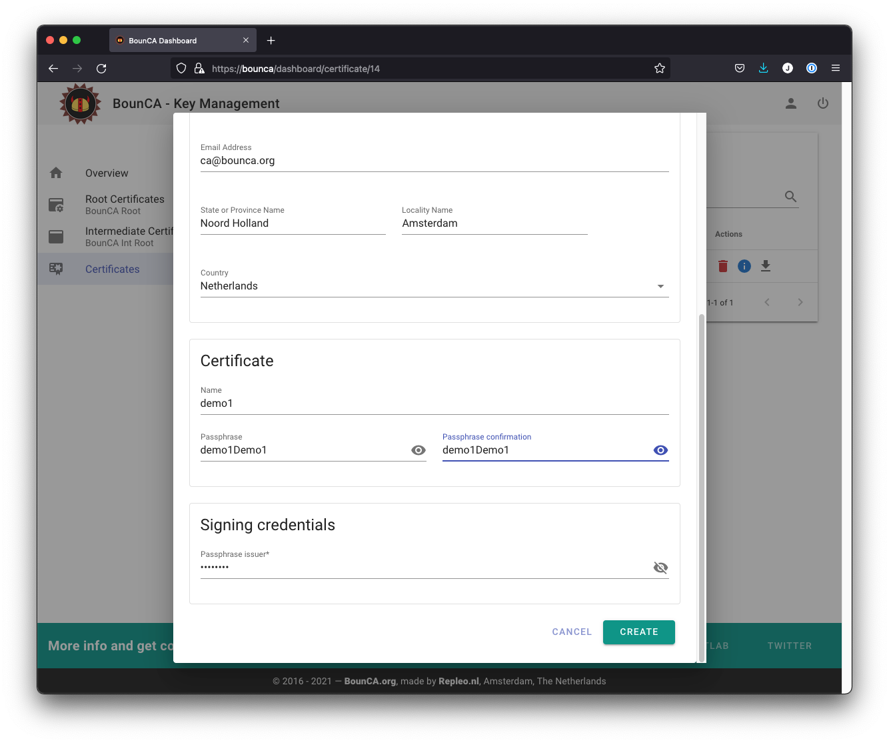

    Fill in the passphrase for demo1

The passphrase of the demo1 certificate is set to *demo1Demo1*. The passphrase secures the certificate, and should be kept secret.

    .. note::

        The passphrase is necessary for Firefox. It is not possible to load unencrypted PCKCS12 blobs in Firefox.

For this tutorial we create a second client certificate, which we will revoke later on.

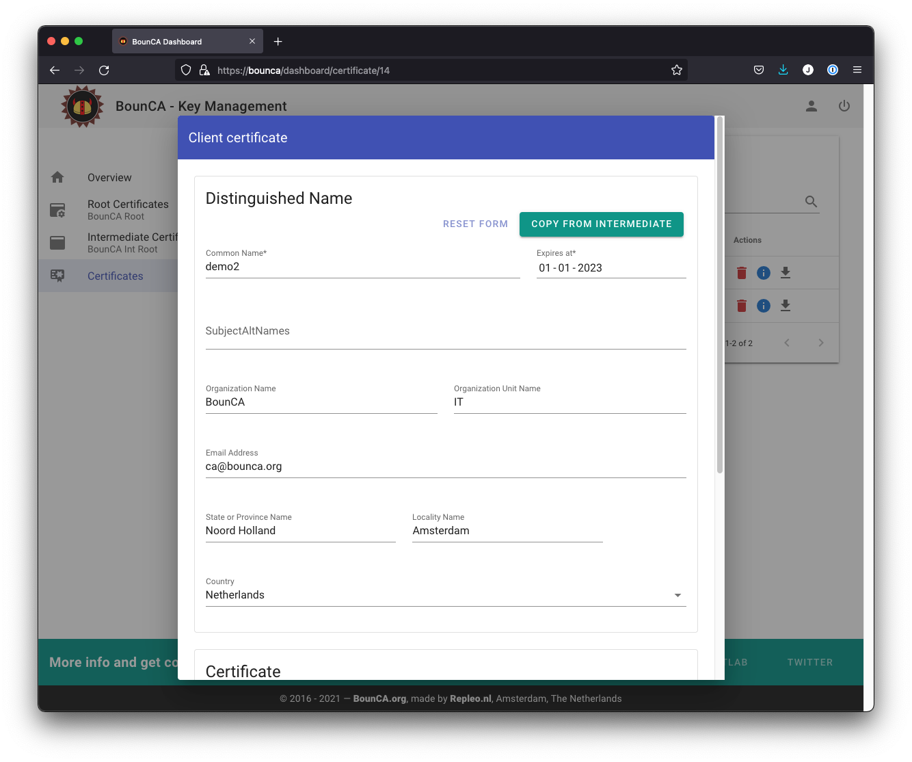

    Create a second client certificate

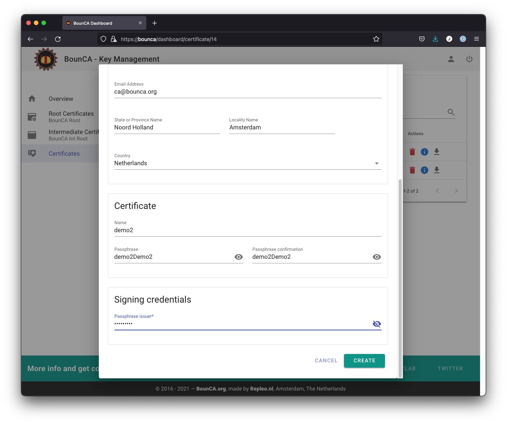

    Fill in the passphrase for demo2

You have now two generated client certificates. Download both certificate zips, we need them later
to sign in to the webserver. It is not possible to download the zip after the demo2 client has
been revoked.

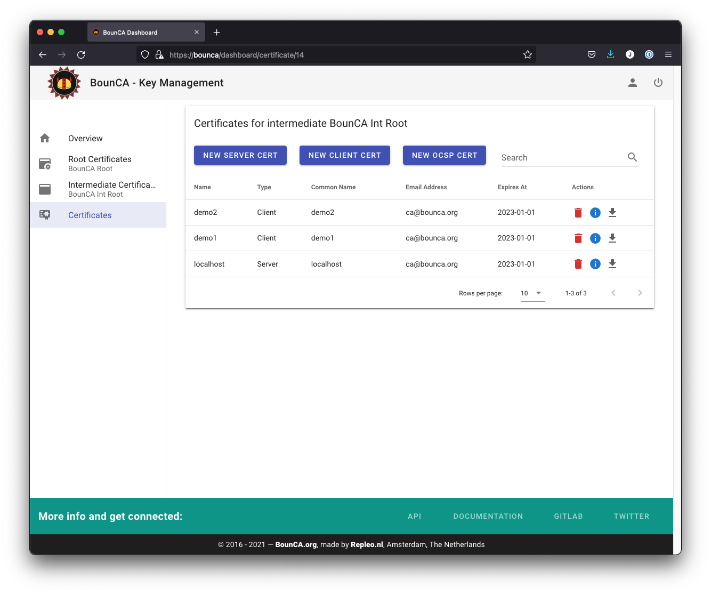

    Overview generated certificates

Press the *delete* icon of the demo2 certificate. A popup will be shown asking for a passphrase.
You need to fill in the passphrase of the intermediate certificate.

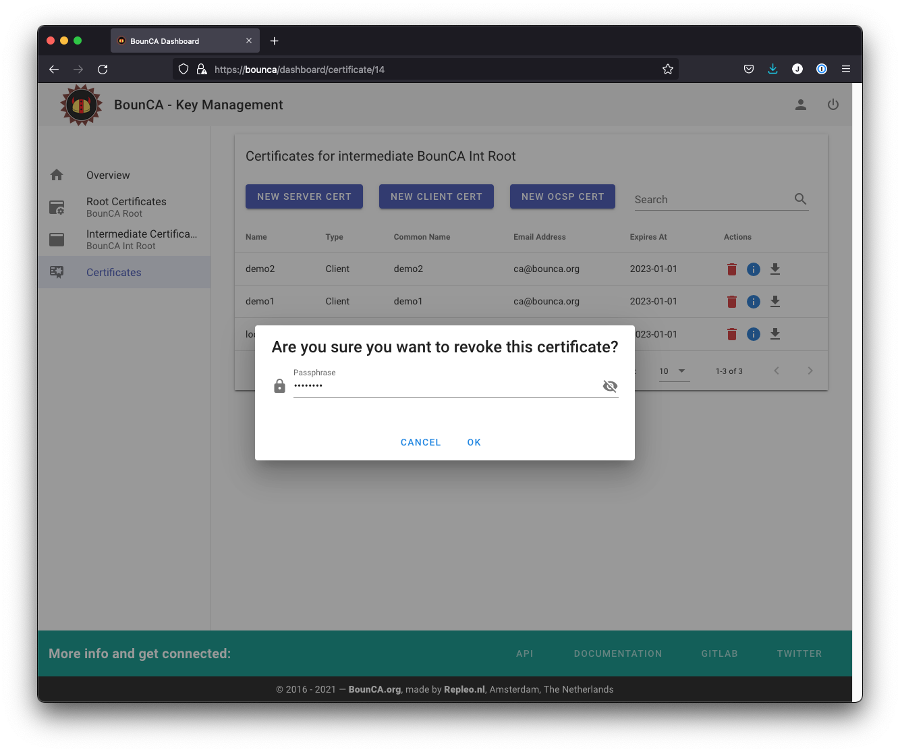

    Enter passphrase of intermediate certificate

    Overview with revoked demo2 certificate

Go to the intermediate certificate. Click on the *CRL* button to download the CRL list. You need to copy it to your webserver hosting the crl file, or in our tutorial, we store it in the configuration of nginx.
You also need to download the intermediate certificate itself. This file will be used as chain to verify the client certificate.

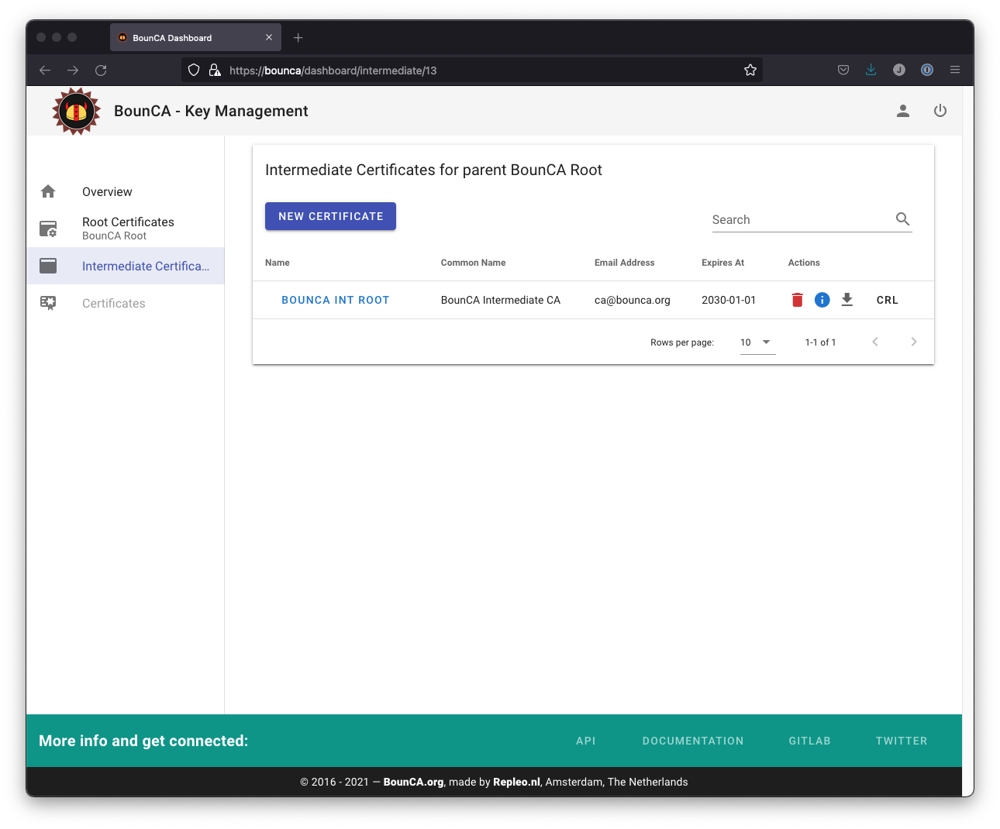

    Download CRL file and intermediate chain pem

Download also the CRL file of the root certificate. We need it later for nginx.

Verify client certificate and Certificate Revocation List (CRL)
~~~~~~~~~~~~~~~~~~~~~~~~~~~~~~~~~~~~~~~~~~~~~~~~~~~~~~~~~~~~~~~

Before we show how to configure Nginx, we first check if the certificates are correctly generated.
All certificates used in these examples can be found in `demo nginx client auth`_.

Open a terminal, and go to the directory where you downloaded the certificates.
First check the validity of the demo1 and demo2 certificate, using the following command:
``openssl verify -CAfile rootca.pem -untrusted intermediate.pem demo1.pem``

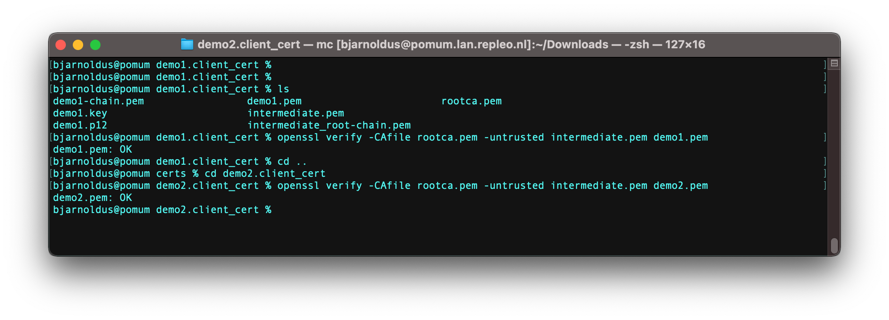

    Verify demo certificates

Check the content of the CRL file. In our case the demo2 certificate has been revoked, so we
would expect one serial of a revoked certificate. Use the command: ``openssl crl -in int.crl.pem -text -noout``.

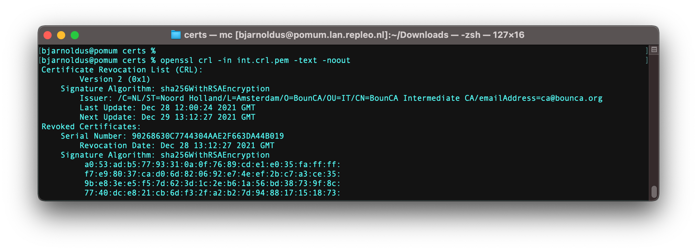

    Content of intermediate CRL file

You can verify the demo2 certificate has been revoked by the following command: ``openssl verify -extended_crl -verbose -CAfile crlchain.pem -crl_check demo1.crt``.
OpenSSL needs the crl file in front of your CA chain. Create it by combining the files: ``cat int.crl.pem intermediate.pem rootca.pem > crlchain.pem``.

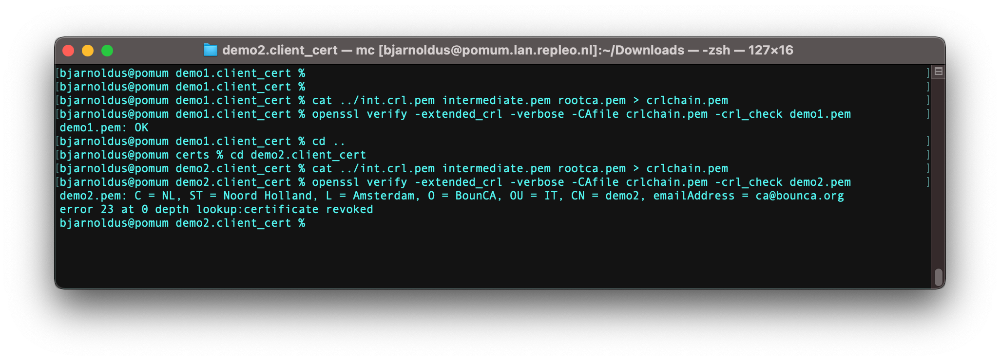

    Revoked certificate

Configure the Nginx webserver for Mutual TLS
~~~~~~~~~~~~~~~~~~~~~~~~~~~~~~~~~~~~~~~~~~~~

We have shown how to generate a client certificate. Now it is time to show a real world use case. A client certificate can be used
to setup a mutual TLS connection with your webserver. In case of mutual TLS, both ends needs to trust each other before an encrypted connection has been
established.

This guide shows you in a couple of steps how to install the enable client certificates on Nginx to enable end-to-end encryption.
You can find the configuration of this tutorial in `demo nginx client auth`_. We assume you have added the root ca to your trusted certificates, as discussed in :ref:`create_root_certificate`.

You need the following files for configuring Nginx:

- ``<domain>-chain.pem``: The server domain certificate including its complete root chain
- ``<domain>.key``: The key of your server domain certificate
- ``BounCA_Int_Root.intermediate-chain.pem``: Chain of intermediate certificate and root certificate, download it via intermediate tab view in BounCA
- ``root_int.crl.pem``: The combined certificate revocation list, create it via the command: ``cat root.crl.pem int.crl.pem > root_int.crl.pem``

Add the following server block to your nginx server:

.. code-block:: nginx

    server {
        listen 443 ssl;
        server_name localhost;
        ssl_certificate      /etc/nginx/certs/localhost-chain.pem;
        ssl_certificate_key  /etc/nginx/certs/localhost.key;

        access_log /var/log/nginx/access.log;
        error_log /var/log/nginx/error.log debug;

        ssl_client_certificate /etc/nginx/certs/BounCA_Int_Root.intermediate-chain.pem;
        ssl_verify_depth 2;
        ssl_verify_client optional;

        if ($ssl_client_i_dn != "emailAddress=ca@bounca.org,CN=BounCA Intermediate CA,OU=IT,O=BounCA,L=Amsterdam,ST=Noord Holland,C=NL") {
          return 403;
        }

        ssl_crl /etc/nginx/certs/root_int.crl.pem;

        location / {

            if ($ssl_client_verify != SUCCESS) {
               return 403;
            }
            root /var/www;
        }
    }

This Nginx configuration is for a mutual TLS connection including revocation support. Lets consider the
configuration file.

The first part is for the HTTPS connection of the domain, equal to the configuration as discussed in :ref:`create_server_certificates`.
The client verification is enabled by ``ssl_verify_client``, we put it on ``optional``. In case of optional, it is possible to generate
a 403 by checking the ``$ssl_client_verify`` variable in the location scope. Other option is ``on``, in that case Nginx will handle it.
The ``ssl_verify_depth`` is 2, to support client certificates signed by an intermediate certificate. The chain for client certificates
is provided via the ``ssl_client_certificate`` parameter. This file should contain the intermediate certificate followed by the root certificate.

Nginx doesn't check the chain of the certificate to verify its validity. If a valid client certificate has been send for the given root authority, Nginx
will just pass it. To check if the client certificate is signed by the desired intermediate issuer, add an extra condition for the ``$ssl_client_i_dn`` variable.
To obtain the value, you can fetch the subject by the following command: ``openssl x509 -in intermediate.pem -noout -subject``.
However, to be sure you have the correct value, you can expose the value of ``$ssl_client_i_dn`` by adding a header in the location scope: ``add_header X-debug-message "$ssl_client_i_dn" always;``.
You will see the issuer dn in the webserver response.

The Certificate Revocation List (crl) is configured via the ``ssl_crl`` parameter. The CRL handler of Nginx requires a CRL file for all certificates in the chain.
Combine the CRL of the root certificate and intermediate: ``cat root.crl.pem int.crl.pem > root_int.crl.pem``.

Start Nginx, and access your webserver using curl: ``curl --cacert rootca.pem --cert demo1.pem --key demo1.key --pass demo1Demo1 https://localhost:8443``.
If you don's supply a client certificate you will get a 403, and in case you supply a revoked certificate, you will get a 400.

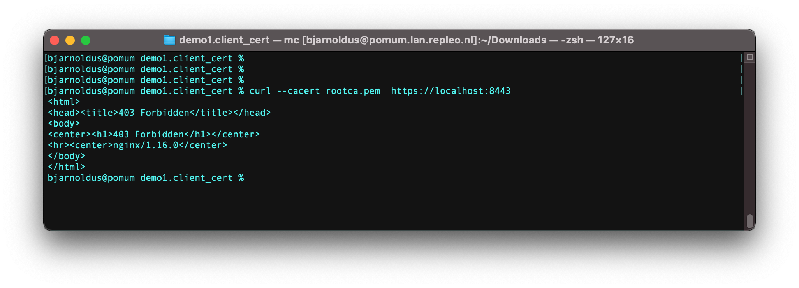

    No client certificate provided, 403 response

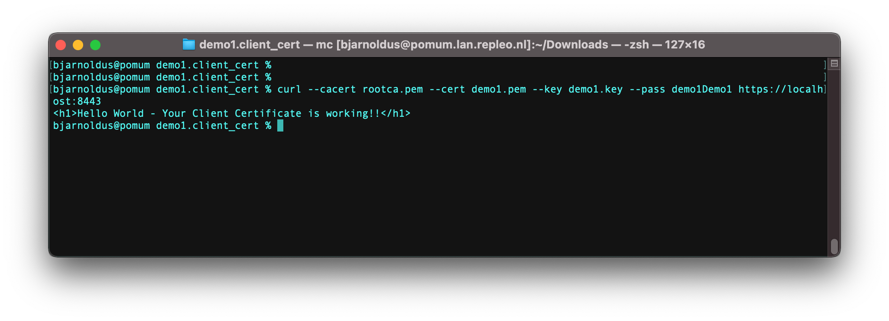

    Valid client certificate provided, 200 OK response

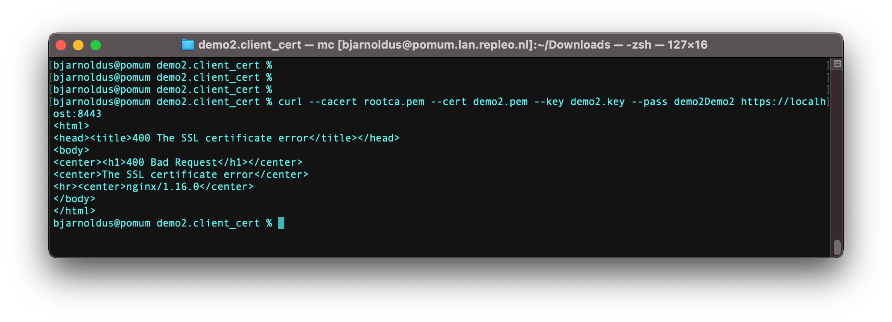

    Revoked client certificate provided, 403 response

Install the SSL client certificate in a Browser for Mutual TLS
~~~~~~~~~~~~~~~~~~~~~~~~~~~~~~~~~~~~~~~~~~~~~~~~~~~~~~~~~~~~~~

To visit your secured webserver via a webbrowser, you need to add the client to your browser.
Adding the certificate to your browser is dependent on the operating system and browser. We discuss
how to add in case of using MacOS.

Most important part is the PKCS12 file (.p12) in your certificate bundle. That file is necessary to add
the client certificate to your browser. We also assume you have installed the root certificate in your browser and/or system.

To install the client certificate for Chrome and Safari in MacOS, just double click on the p12 file. The KeyChain manager will open, and asks for your passphrase.
After you entered your passphrase, you can use the certificate in Chrome and Safari. The browser will ask to use the certificate for authentication.

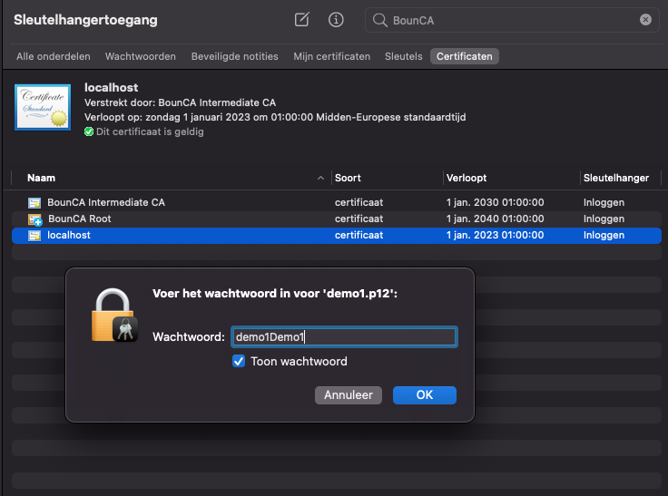

    Adding client certificate to keychain of macOS

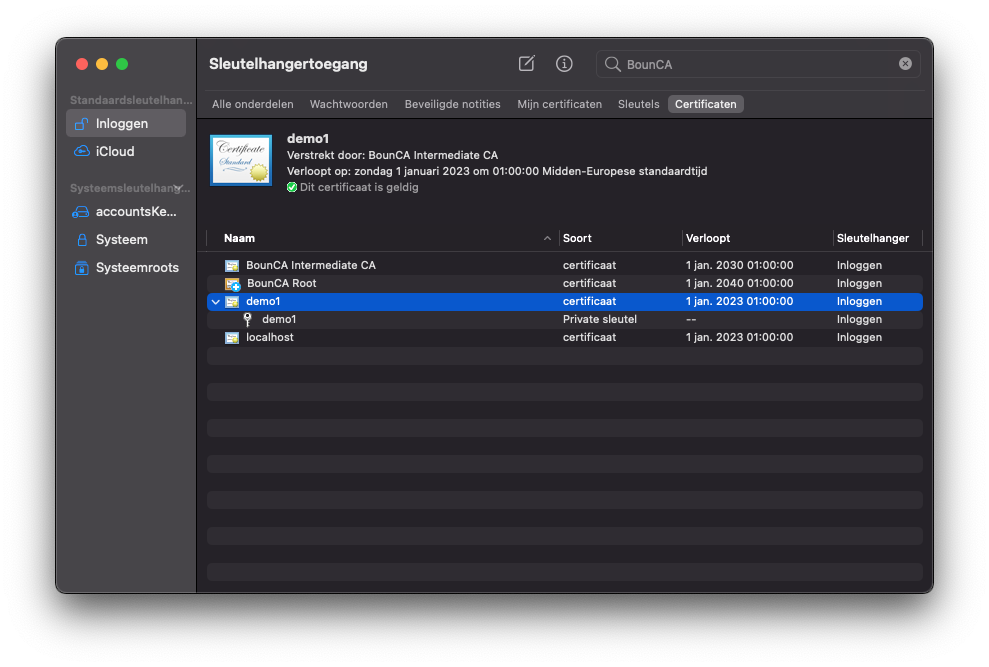

    Client certificate to keychain of macOS has been added

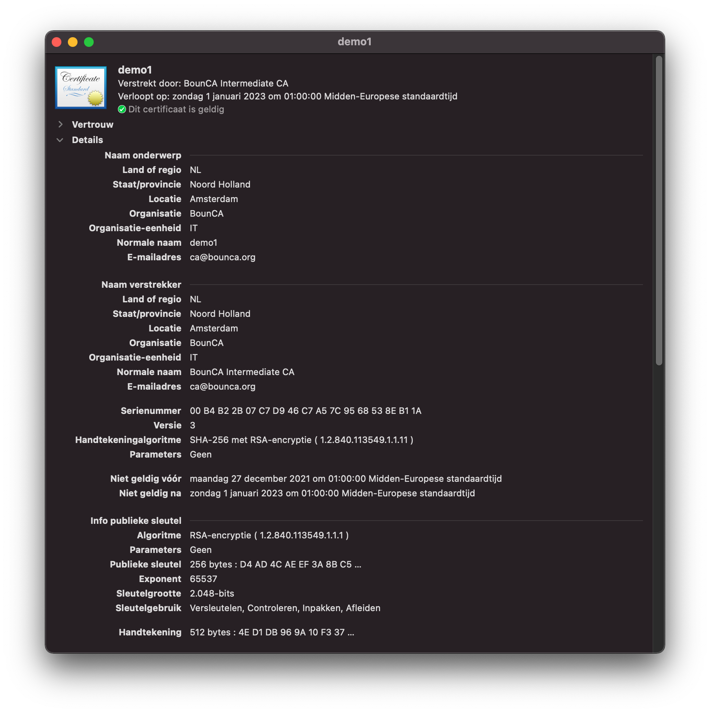

    Inspect client certificate

The certificate is installed, and also trusted. Open Safari, and visit the demo site. In our case ``https://localhost:8443``.

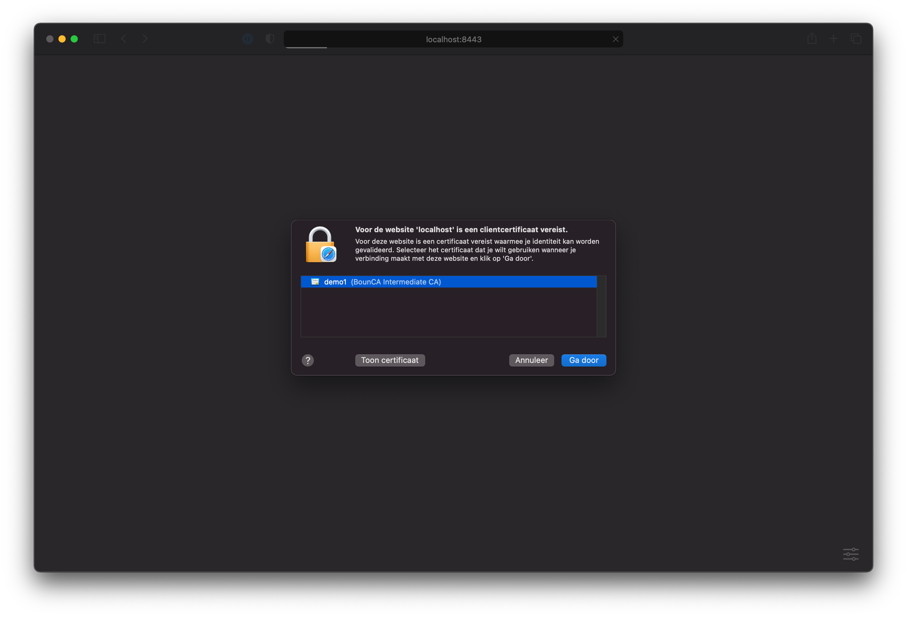

    Visit mutual TLS site with Safari

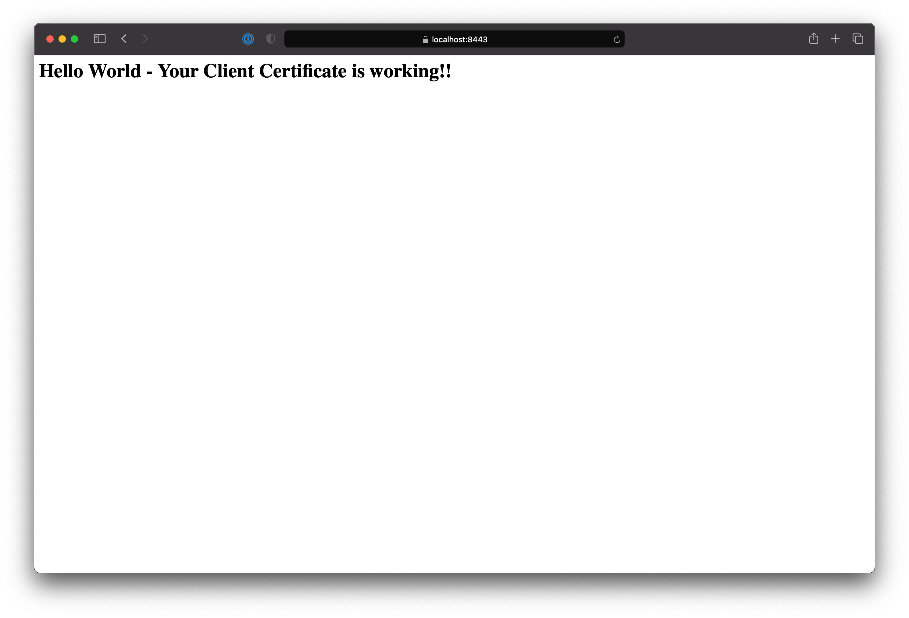

    Granted client certificate using Safari

The site is granted in Safari, the same can be done in Chrome (or Chromium). In macOS Chrome will use the keychain
certificates, so no extra configuration is necessary.

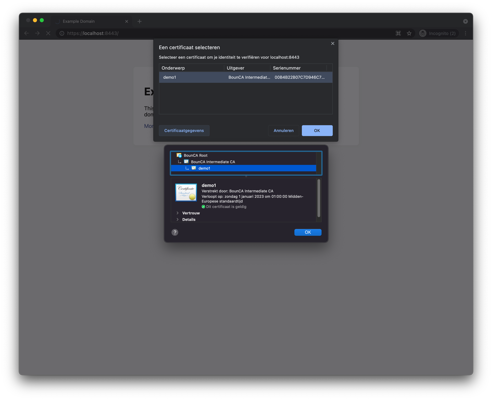

    Visit mutual TLS site using Chrome

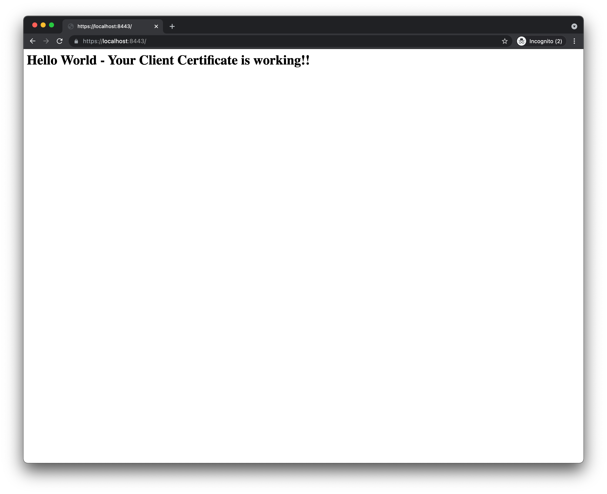

    Granted client certificate using Chrome

Firefox requires a little more work. You need to add the client certificate, and root certificate to Firefox as the keychain is not used by this browser.
Go to settings of Firefox, and click on the security pane. Scroll to the certificate management part, and click on view certificates.

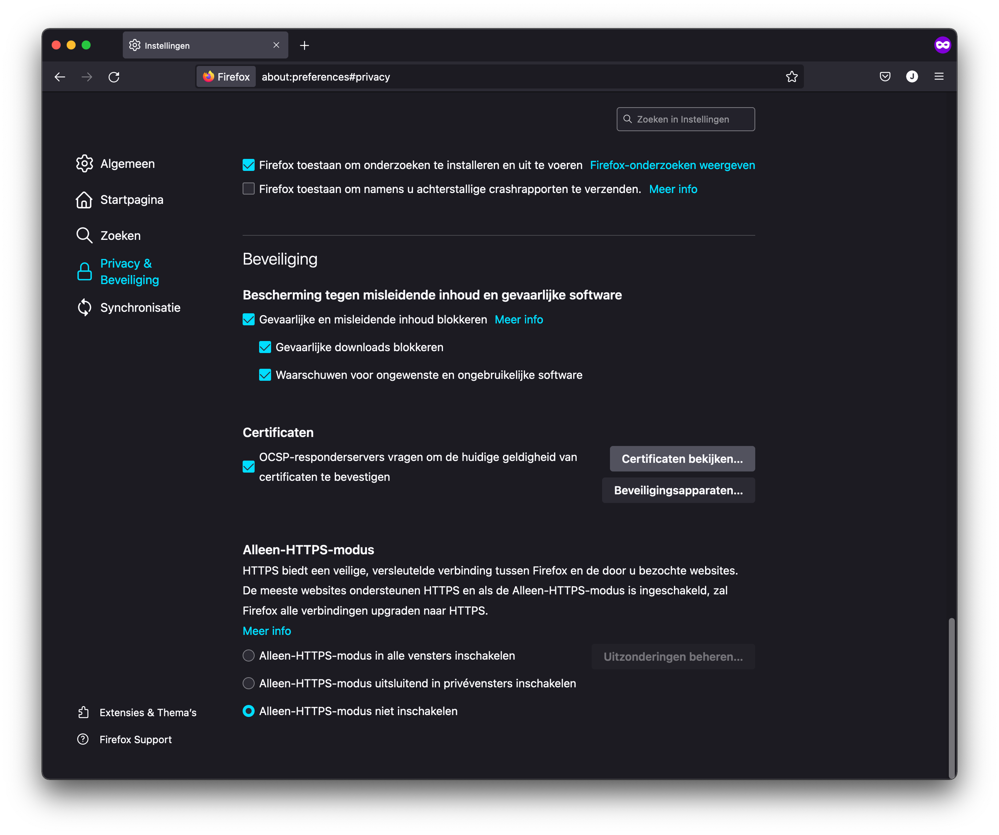

    Open certificate management in Firefox

Import the PKCS12 bundle in th first pane of the certificate view.

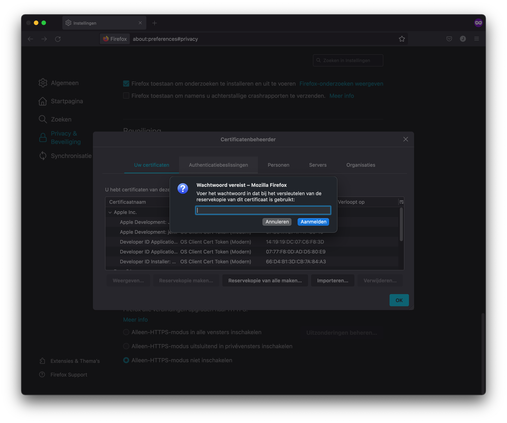

    Import client certificate PKCS12 bundle in Firefox

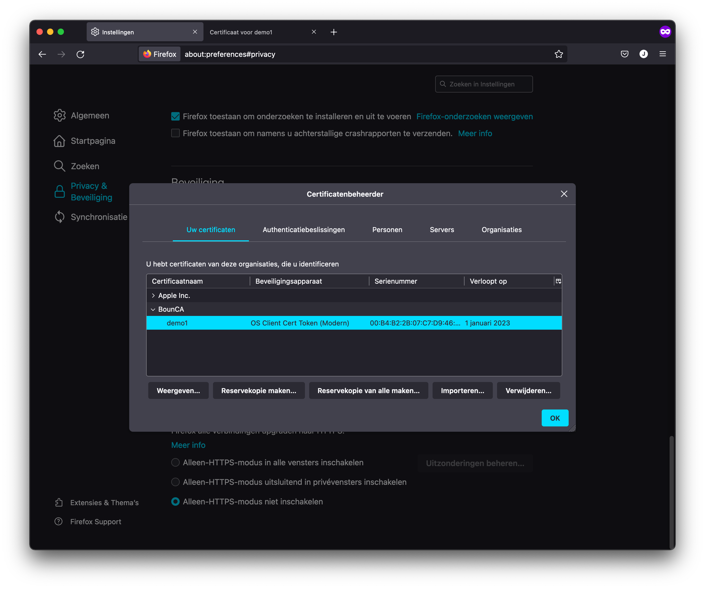

    Client certificate added to Firefox

When you added the client certificate, you can browse to the mutual TLS site. Firefox will ask which certificate it should
use for authentication.

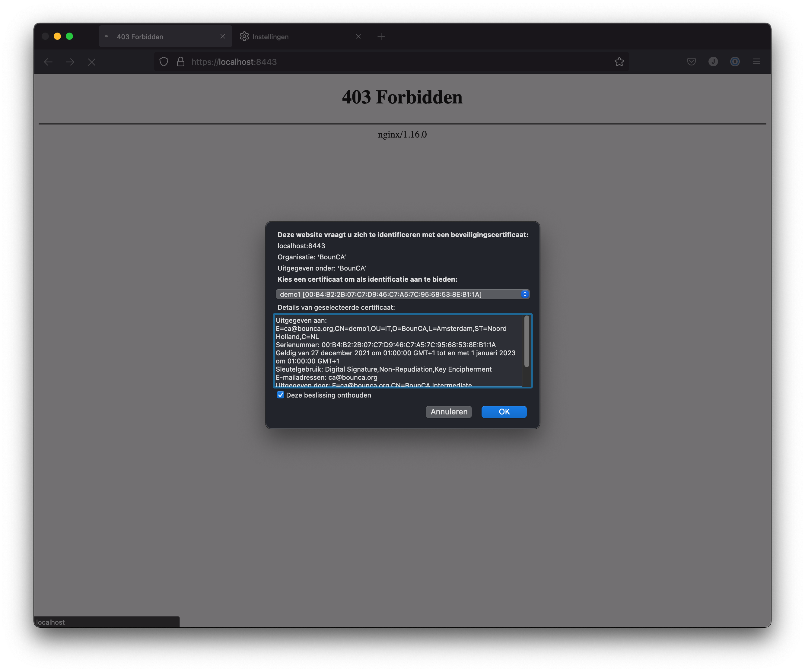

    Visit mutual TLS site using Firefox

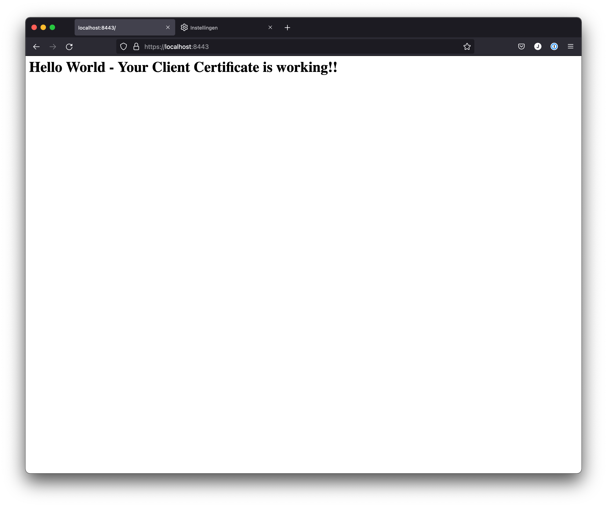

    Granted client certificate using Firefox

That's it! We have shown how you can generate client certificates and enable mutual TLS connections using certificates by your trusted CA.

.. _demo nginx client auth: https://gitlab.com/bounca/bounca/-/tree/master/docs/source/demo/nginx_client_auth
