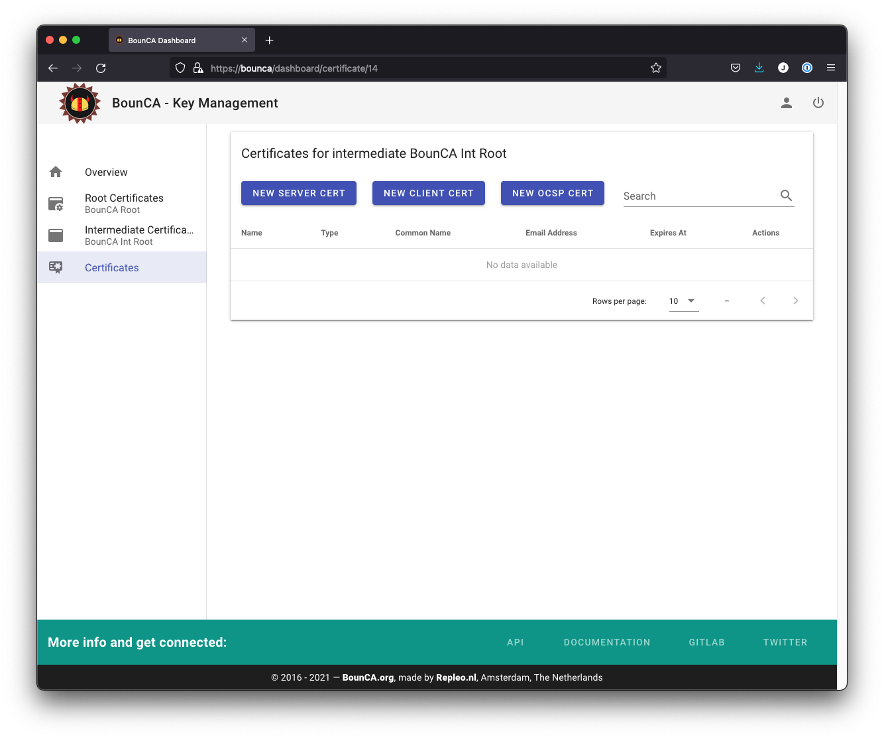
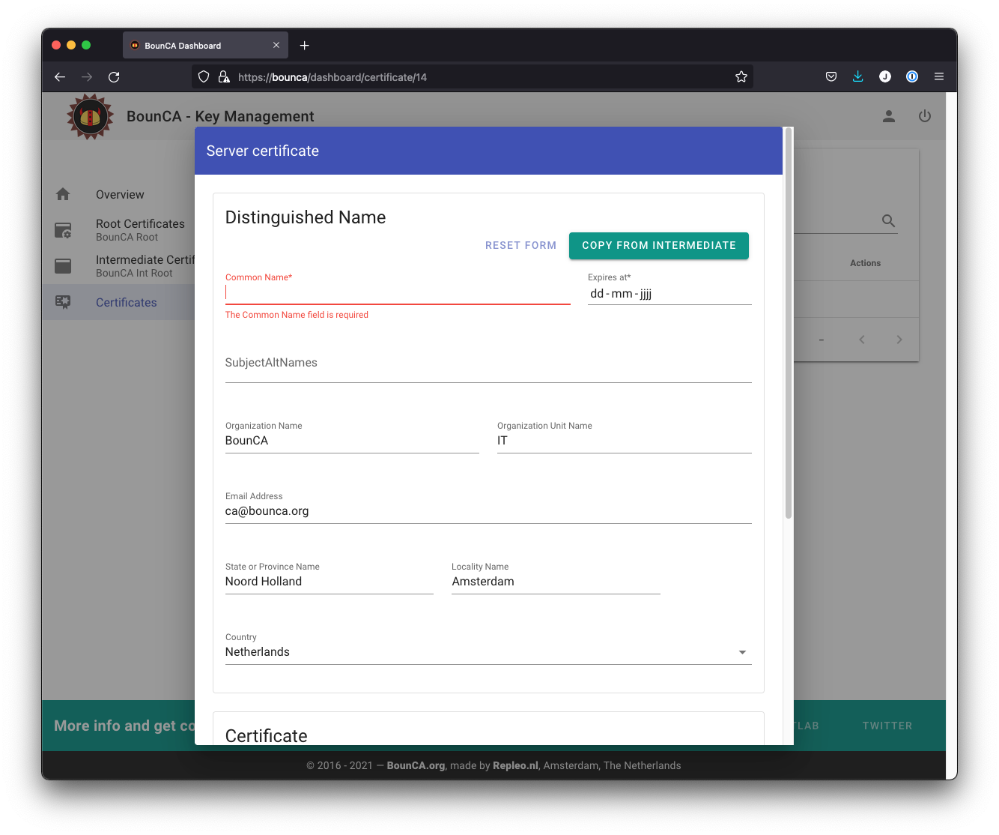
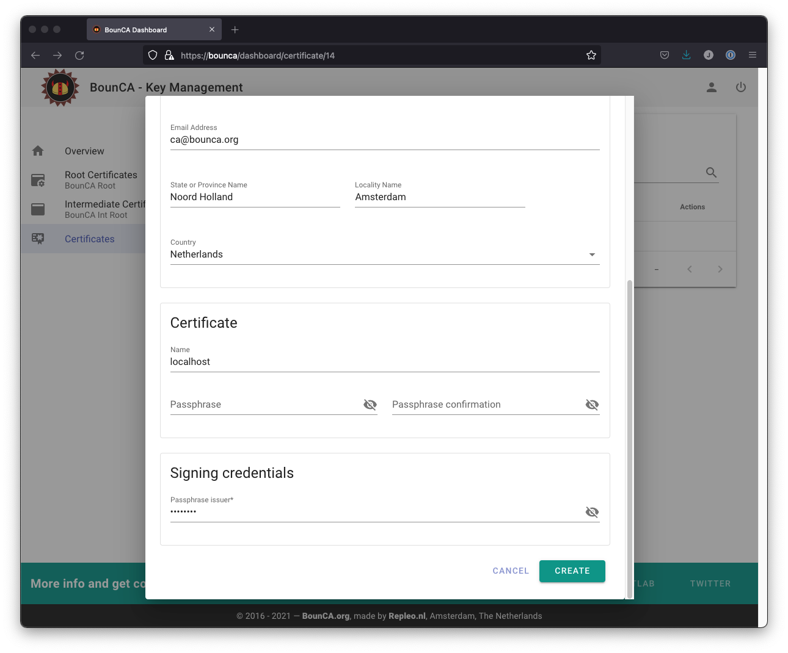
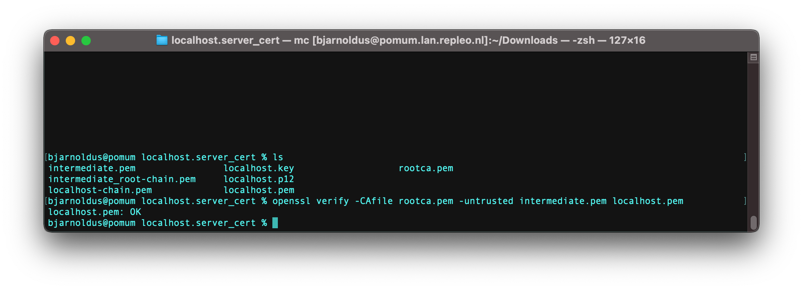
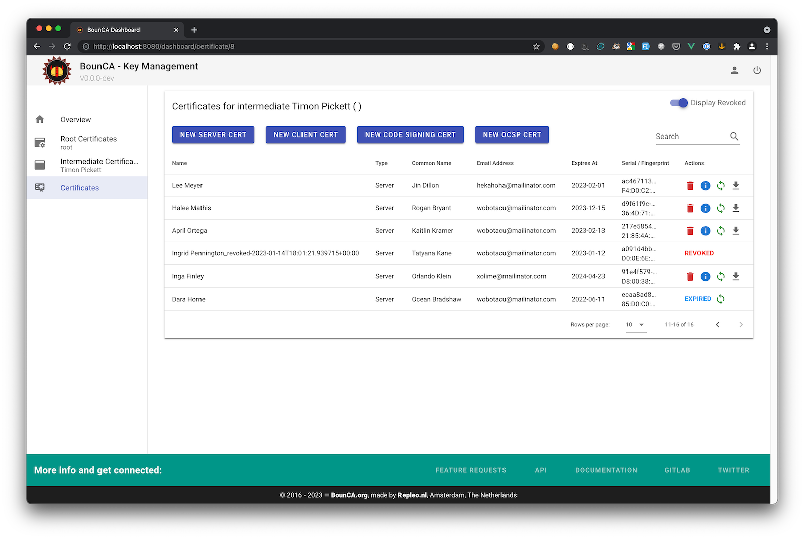
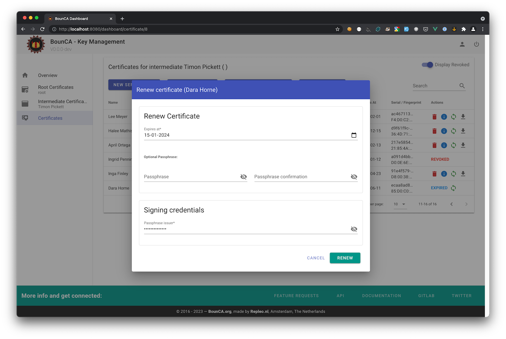
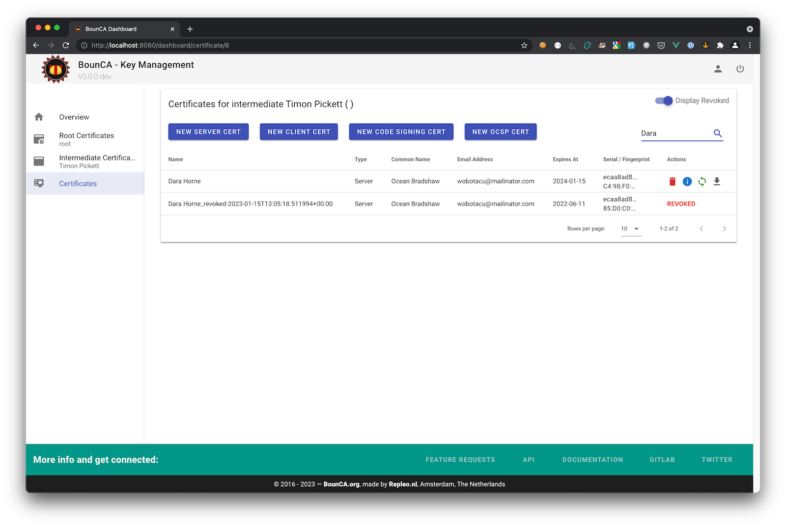

:header_title: Self-Signed Server Certificate
:header_subtitle: Step-by-step guide to generate and install a Server SSL certificate.

.. _create_server_certificates:

Create Server Certificate
=====================================

This document will show you can generate a server certificate with BounCA.
We assume you have a working BounCA and create a certificate authority, see :ref:`create_root_certificate`.

Generate Server Certificate
~~~~~~~~~~~~~~~~~~~~~~~~~~~

You can use a server certificate to configure secure (SSL/TLS) and trusted connections, such as HTTPS, but also SMTP, IMAP etcetera.

Enter the dashboard of your intermediate CA which must sign your server certificate.

    Step into intermediate certificate

Click on the *New Server Cert* button to add a new server certificate, and a form will be shown.
For server certificates, the *Common Name* must be a fully qualified domain name (eg, ``www.example.com``), and you also
need to add it in the SubjectAltNames field.
Note that the *Common Name* cannot be the same as either your root or intermediate certificate.

Certificates are usually given a validity of one year, though a CA will typically give a few days extra for convenience.
Our root and intermediate pairs are 4096 bits. Server and client certificates normally expire after one year, so we can safely use 2048 bits instead.

    .. note::

        Although 4096 bits is slightly more secure than 2048 bits, it slows down TLS handshakes and significantly increases processor load during handshakes.
        For this reason, BounCA uses 2048-bit pairs.

.. figure:: ../images/generate-server-certificate/13-create-ssl-server-certificate.png
    :width: 800px
    :align: center
    :alt: Create SSL server certificate
    :figclass: align-center

    Create SSL server certificate

You can copy the distinguished name information from the intermediate certificate by pressing the *Copy From Intermediate* button.

    Copy Distinguished Name from Intermediate

You can use the certificate for multiple domains and IP adresses using the SubjectAltNames fields of the X.509v3 extensions.

.. figure:: ../images/generate-server-certificate/14-enter-subject-alternative-names.png
    :width: 800px
    :align: center
    :alt: Enter subject alternative names
    :figclass: align-center

    Enter subject alternative names

You need to provide the passphrase of the intermediate certificate to sign the key of your server certificate.
It is not necessary to provide a passphrase for the server certificate self. If you install the certificate on a server, having a passphrase on the server key will block automatic restart.

    Enter passphrase issuer certificate

The server certificate will be generate.

.. figure:: ../images/generate-server-certificate/15-server-certificate-generated.png
    :width: 800px
    :align: center
    :alt: Enter passphrase issuer certificate
    :figclass: align-center

    Server certificate has been generated

You might inspect the new certificate.
The *Issuer* is the intermediate CA. The *Subject* refers to the certificate itself.

.. figure:: ../images/generate-server-certificate/15-inspect-server-certificate.png
    :width: 800px
    :align: center
    :alt: Inspect server certificate
    :figclass: align-center

    Inspect server certificate

You can also see the subject alt names in the *X509v3 extensions* section of the certificate.

.. figure:: ../images/generate-server-certificate/16-inspect-server-certificate-crl-ocsp.png
    :width: 800px
    :align: center
    :alt: Inspect CRL and OCSP revocation links
    :figclass: align-center

    Inspect CRL and OCSP revocation links

Install the SSL key on a Nginx webserver
~~~~~~~~~~~~~~~~~~~~~~~~~~~~~~~~~~~~~~~~

This guide shows you in a couple of steps how to install the generated SSL certificate on Nginx to provide HTTPS access to your webserver.
You can find the configuration of this tutorial in `demo nginx ssl`_.

First, you can download a packaged key and certificate zip from BounCA.

.. figure:: ../images/generate-server-certificate/18-ssl-certificate-zip-package.png
    :height: 350px
    :align: center
    :alt: Content of the SSL certificate zip package
    :figclass: align-center

    Content of the SSL certificate zip package

The zip package contains multiple files:

- ``rootca.pem``: The root authority certificate
- ``intermediate.pem``: The intermediate authority certificate
- ``intermediate_root-chain.pem``: Chain of intermediate certificate and root certificate
- ``<domain>-chain.pem``: The certificate including its complete root chain
- ``<domain>.key``: The key of your certificate
- ``<domain>.pem``: The certificate file
- ``<domain>.p12``: A PKCS12 keystore containing the key and certificate

We assume you have added the root ca to your trusted certificates.
If you open the ``<domain>-chain.pem`` you can check the trusted chain.
Or you can use openssl to verify the chain: ``openssl verify -CAfile rootca.pem -untrusted intermediate.pem localhost.pem``.
The command should return ``OK``.

    Verify self-signed certificate is trusted via OpenSSL

To enable SSL within nginx you should copy ``<domain>-chain.pem`` and ``<domain>.key`` to your nginx SSL folder.
Make sure you set the access rights:
- ``<domain>-chain.pem``: 0x644 for nginx user
- ``<domain>.key``: 0x400 for nginx user

Add the following server block to your nginx server:

.. code-block:: nginx

   server {
          listen       443 ssl;
          server_name  localhost;

          ssl_certificate      ssl/<domain>-chain.pem;
          ssl_certificate_key  ssl/<domain>.key;

          location / {
                  root   html;
                  index  index.html index.htm;
          }

   }

It specifies that the server should listen to port 443, using SSL and it defines where it can find the key/certificate pair.

Restart the server and visit your website. It should show a valid and trusted HTTPS connection, and you will see the lock in the URL bar of the browser.
When you click on the lock, you will see that the SSL connection is trusted using your personal self-signed certificate and root authority.

.. figure:: ../images/generate-server-certificate/28-visit-website-trusted-ssl-connection-https.png
    :width: 800px
    :align: center
    :alt: Verify HTTPS connection is now valid and trusted
    :figclass: align-center

    Verify HTTPS connection is now valid and trusted

Renew Certificate
~~~~~~~~~~~~~~~~~~~~~~~~~~~~~~~~~~~~~~~~

Server, Client and Mail certificates are usually only valid for one year. To create a new valid certifcate
you must generate a new one with a new expiration date. BounCA offers a renewal button to renew the certificate.
It is the green double arrow button next to the certificate.

    List with certificates, and including expired ones

When you press the renew button a dialog modal will open where you can set a new expiration data, and fill in the
passphrases. The passphrase of the signing parent certifacte is required.

    Renew certificate modal

After you press renew, the old certificate will be revoked, and a new one is generated using the same information
as the old certificate. The only field what will change is the expiration date. After generation, download the
certificate, and install it on the server. Also the CRL of the authority will be updated.

    Result of the renewal of certificate

.. _demo nginx ssl: https://gitlab.com/bounca/bounca/-/tree/master/docs/source/demo/nginx_ssl
