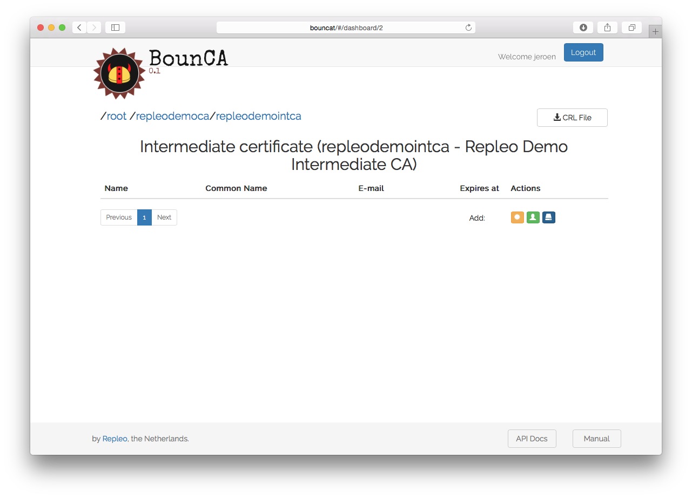
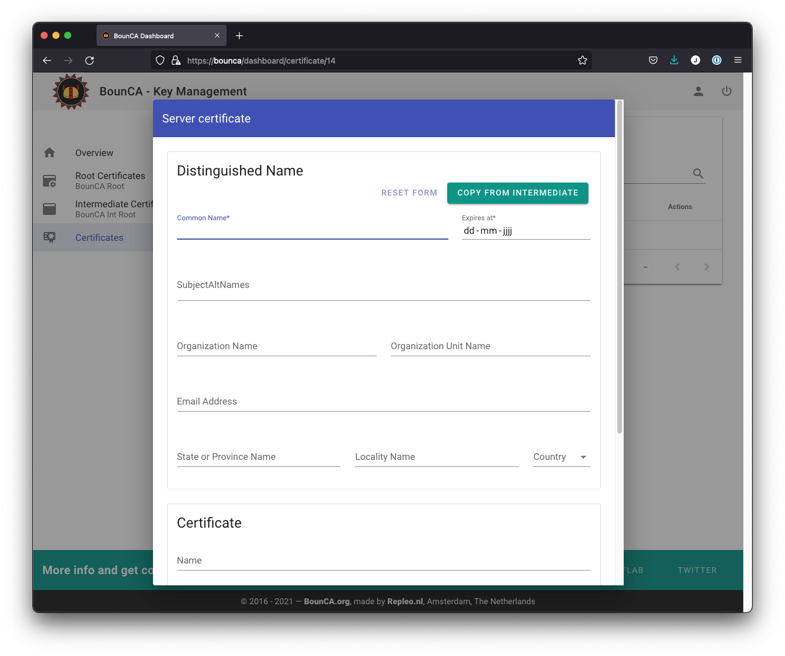
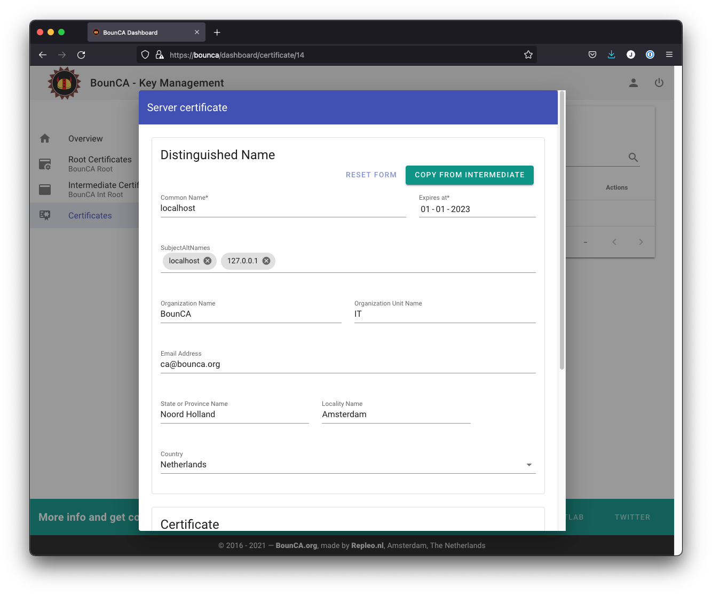
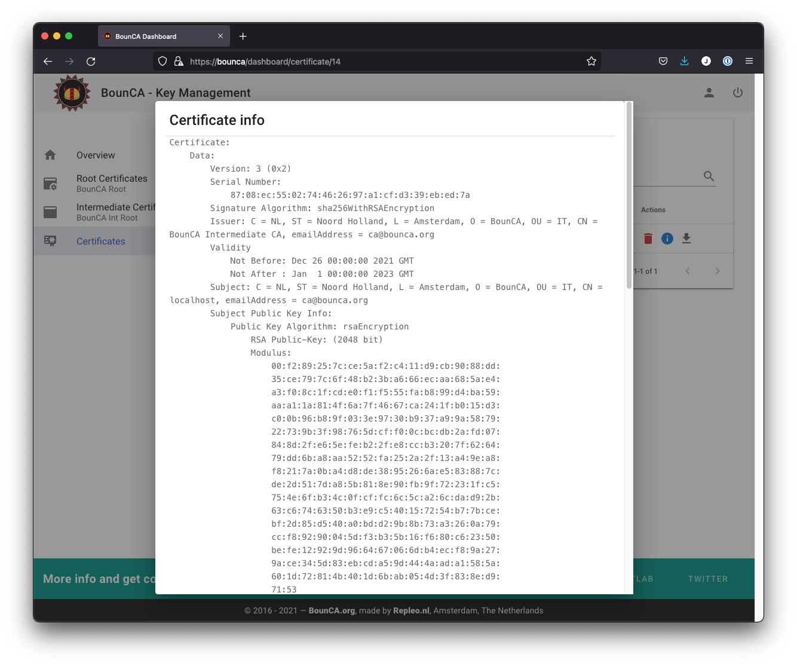
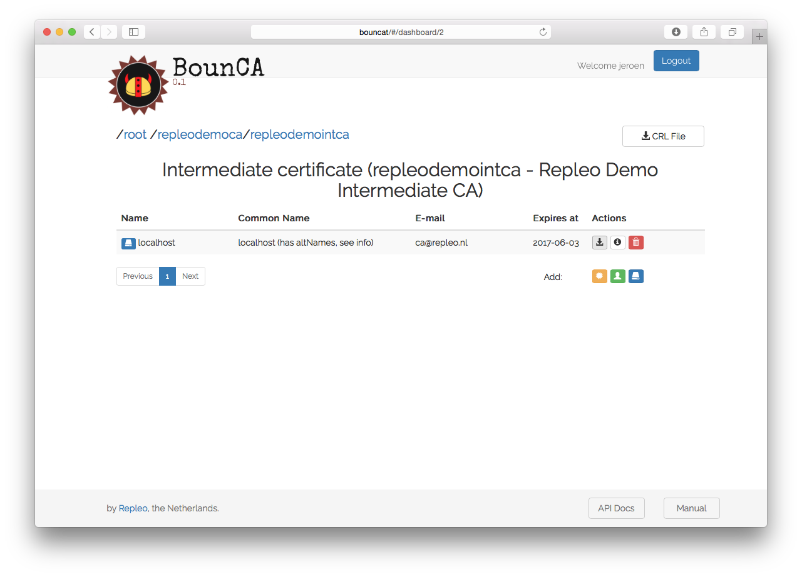
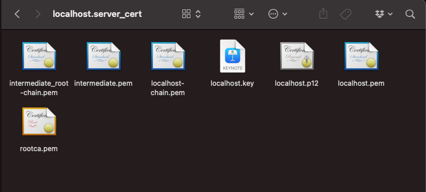
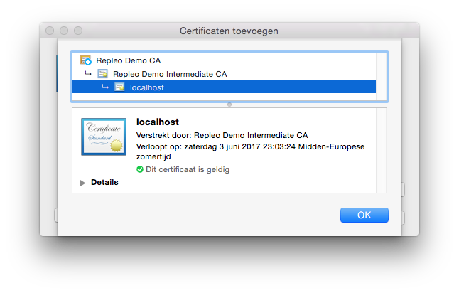
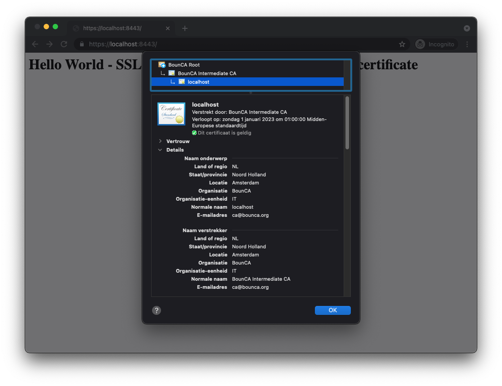

:header_title: Self-Signed Server Certificate
:header_subtitle: Step-by-step guide how to generate and install a self-signed SSL certificate.

Create Self-Signed Server Certificate
=====================================

This document will show you can generate a server certificate with BounCA.
We assume you have a working BounCA and create a certificate authority.

---------------------------------

Generate Server Certificate
~~~~~~~~~~~~~~~~~~~~~~~~~~~

You can use a server certificate to configure secure and trusted connections, such as HTTPS, but also SMTP, IMAP etcetera.

Enter the dashboard of your intermediate CA which must sign your server certificate.

    Step into intermediate certificate

Click on the blue *server* button to add a new server certificate, and a form will be shown.
For server certificates, the *Common Name* must be a fully qualified domain name (eg, ``www.example.com``). 
Note that the *Common Name* cannot be the same as either your root or intermediate certificate.

Certificates are usually given a validity of one year, though a CA will typically give a few days extra for convenience.
Our root and intermediate pairs are 4096 bits. Server and client certificates normally expire after one year, so we can safely use 2048 bits instead.

.. note:: Although 4096 bits is slightly more secure than 2048 bits, it slows down TLS handshakes and significantly increases processor load during handshakes. 
          For this reason, most websites use 2048-bit pairs.

    Create SSL server certificate

You can use the certificate for multiple domains using the subject alternative names fields of the X.509v3 extensions.
Provide all valid domains as a comma separated list to the subject alternative names field.

You need to provide the passphrase of the intermediate certificate to sign the key of your server certificate.
It is not necessary to provide a passphrase for the server certificate self. If you install the certificate on a server, having a passphrase on the server key will block automatic restart.

    Enter subject alternative names

The server certificate will be generate. You might inspect the new certificate.
The *Issuer* is the intermediate CA. The *Subject* refers to the certificate itself.

    Inspect server certificate

You can also see the subject alt names in the *X509v3 extensions* section of the certificate. 

.. figure:: ../images/generate-server-certificate/16-inspect-server-certificate-crl-ocsp.png
    :width: 800px
    :align: center
    :alt: Inspect CRL and OCSP revocation links
    :figclass: align-center

    Inspect CRL and OCSP revocation links

Install the SSL key on a nginx webserver
~~~~~~~~~~~~~~~~~~~~~~~~~~~~~~~~~~~~~~~~

This guide shows you in a couple of steps how to install the generated SSL certificate on NGINX to provide HTTPS access to your webserver.
First, you can download a packaged key and certificate zip from BounCA.

    Download SSL certificate zip package

The zip package contains multiple files:

- ``rootca.pem``: The root authority certificate
- ``<domain>.key``: The key of your certificate
- ``<domain>.pem``: The certificate file
- ``<domain>.csr``: The sign request of the certificate
- ``<domain>-chain.pem``: The certificate including its complete root chain
- ``<domain>.p12``: A PKCS12 keystore containing the key and certificate

    Content of the SSL certificate zip package

We assume you have added the root ca to your trusted certificates.
If you open the chain.pem you can check the trusted chain.

To enable SSL within nginx you should copy ``<domain>-chain.pem`` and ``<domain>.key`` to your nginx SSL folder.
Make sure you set the access rights:
- ``<domain>-chain.pem``: 0x644 for nginx user
- ``<domain>.key``: 0x400 for nginx user

Add the following server block to your nginx server:    
  
.. code-block:: nginx

   server {
          listen       443 ssl;
          server_name  localhost;
      
          ssl_certificate      ssl/<domain>-chain.pem;
          ssl_certificate_key  ssl/<domain>.key;
      
          location / {
                  root   html;
                  index  index.html index.htm;
          }
      
   }

It specifies that the server should listen to port 443, using SSL and it defines where it can find the key/certificate pair.

Restart the server and visit your website. It should show a valid and trusted HTTPS connection, and you will see the lock in the URL bar of the browser.

    Verify self-signed certificate is now trusted
    

When you click on the lock, you will see that the SSL connection is trusted using your personal self-signed certificate and root authority.

    Verify HTTPS connection is now valid and trusted
    

    

  