:header_title: Guide to add self-generated root certificate authorities for 8 operating systems and browsers
:header_subtitle: Easy installation of self-generated root certificates

.. _install_root_certificates:


Install self-generated root certificates
===================================================

After you have generated your root authority with BounCA (:ref:`getting_started`), your root certificates needs to be added to your systems to let them trust your issued certificates.
Most operating systems offer the ability to add additional trust rules for self-generated root certificate authorities.
When the root certificate is trusted by the operating system, the system will accept all its signed certificates.

This guide shows how to add a root certificate to popular operating systems and browsers.
Installation is most times, install the root certificate and all issued certificates are accepted. Sometimes you also
need to add the intermediate certificates, in the same manner as the root certificate.
After having trusted the certificate you will see the green lock for your self-signed certificates.

The prerequisite is that you have downloaded the root certificate file, or made it available via a website.
The root certificate PEM file is public and you can distribute it to everyone.
While distributing the certificate make sure you use secured connections and provide the fingerprint via a separate channel so the receiver can verify the root certificate is not intercepted.


.. _mac_os_x:

Mac OS X
~~~~~~~~

OS X offers the installation of certificates via a gui interface or via the commandline.
We will discuss both methods. We assume you have stored the root certificate on your file system.


Keychain GUI
````````````

Double click on the certificate file. The key manager programm will start and it will show you the certificate.
Check the validity of the certificate.


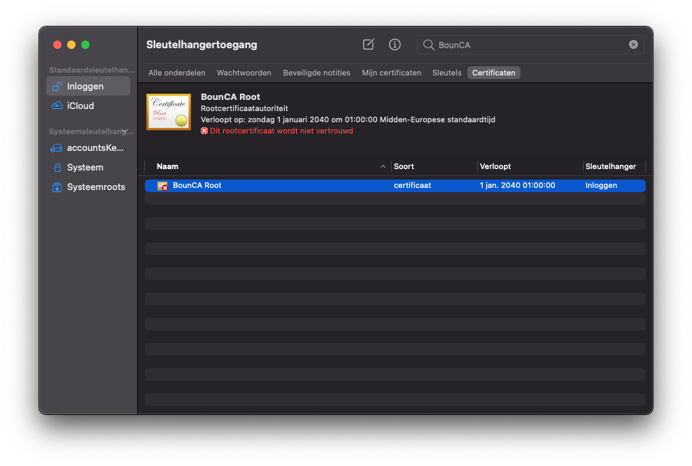

    Install root CA pem file on MacOS

Right click on the certificate to inspect it.

.. figure:: ../images/install_root_certificate/21-inspect-root-pem-certificate.png
    :width: 500px
    :align: center
    :alt: Install root CA pem file MacOS
    :figclass: align-center

    Validate root CA PEM on MacOS

If everything is correct, you can trust the certificate as root authority. A dialog pops up to enter
your password.
MacOS will trust the root CA's signed certificates after you have added the certificate to your trust chain.


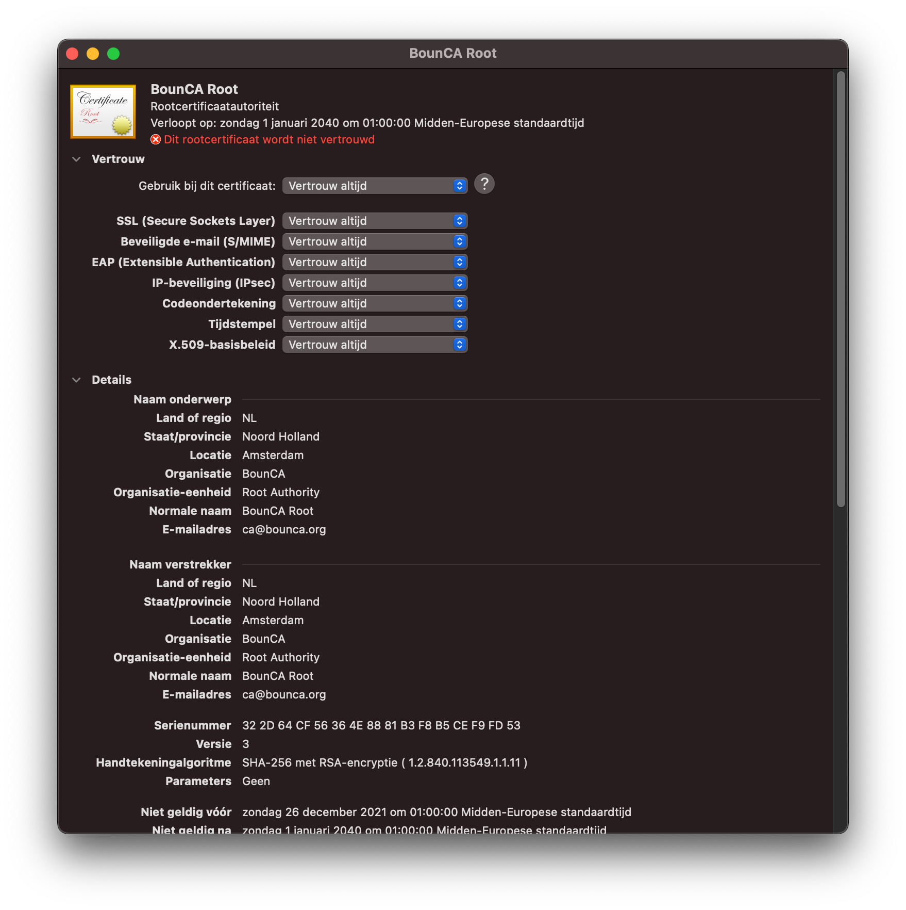

    Trust your root certificate

Re-open the key manager, search for your root certificate. You will notice it is now trusted by MacOS.

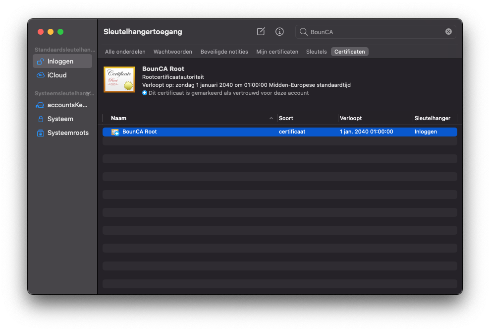

    Trusted root certificate

If you inspect the certificate you see it is valid and trusted.

.. figure:: ../images/install_root_certificate/26-root-ca-is-trusted.png
    :height: 500px
    :align: center
    :alt: Verify root CA has been trusted
    :figclass: align-center

    Verify root CA has been trusted


Keychain GUI
````````````

OS X offers also a command line interface to trust and remove certificates.

Use the following command to add a certificate:

.. code-block:: shell

   sudo security add-trusted-cert -d -r trustRoot -k /Library/Keychains/System.keychain <new-root-certificate>

Use the following command to remove a certificate

.. code-block:: shell

   sudo security delete-certificate -c "<name of existing certificate>"

.. _ios:

iPhone, iPad (IOS)
~~~~~~~~~~~~~~~~~~

Installing a certificate on an IOS device, such as the iPhone or iPad, is a couple of a few clicks. To get the certificate on the IOS device, you can either mail the certificate file or provide it via a webserver.
After you have downloaded the certificate to the IOS device, click on it. It opens the following screen.

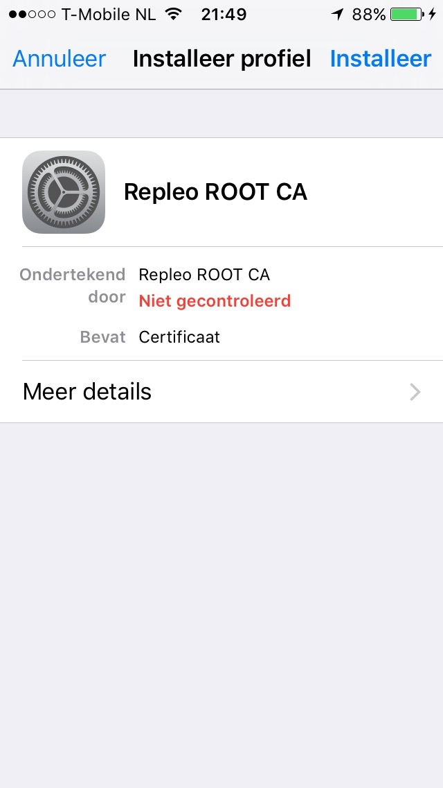

    IOS open certificate

After you have validated that the certificate is indeed the one you want to trust, press the install button.

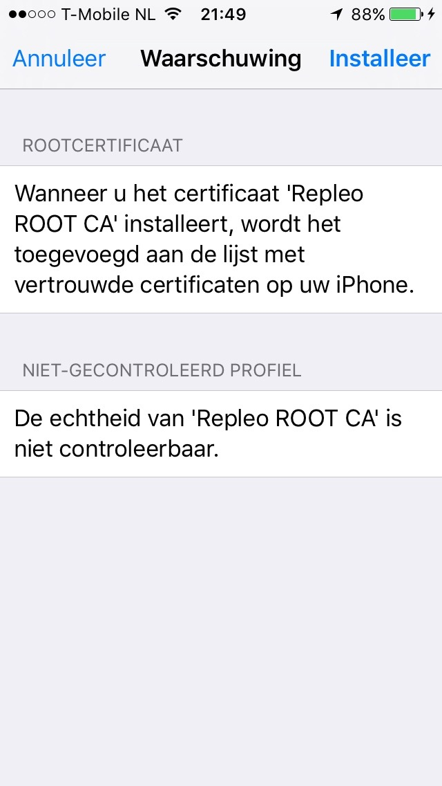

    IOS trust new certificate

IOS will show you a warning if you are really sure.
The reason of the warning is obvious, if you trust a certificate, it will be possible to perform man-in-the-middle attacks using that certificate. So, you want to be really sure it is your root certificate.
Click on the install and you will see the final screen that the certificate has been trusted.


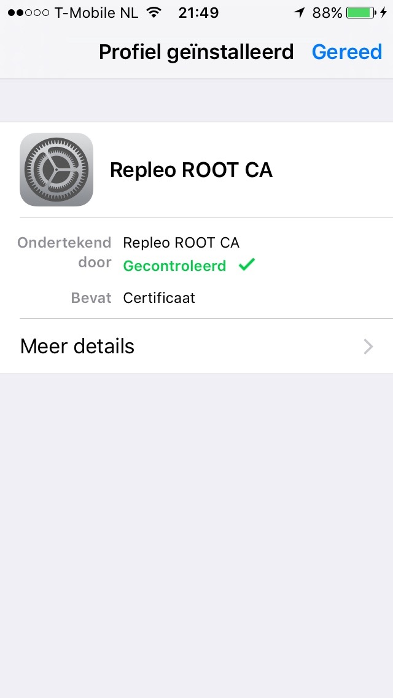

    IOS certificate installed

.. _windows:

Windows
~~~~~~~

Make sure you have the ``Administrator`` role or group membership.

You need to perform the following steps to add certificates to the *Trusted Root Certification Authorities* store for a local computer:

1. Click *Start*, click *Start Search*, type ``mmc``, and then press *ENTER*.
2. On the *File* menu, click *Add/Remove Snap-in*.
3. Under *Available snap-ins*, click *Certificates*, and then click *Add*.
4. Under *This snap-in will always manage certificates for*, click *Computer account*, and then click *Next*.
5. Click *Local computer*, and click *Finish*.
6. If you have no more snap-ins to add to the console, click *OK*.
7. In the console tree, double-click *Certificates*.
8. Right-click the *Trusted Root Certification Authorities* store.
9. Click *Import* to import the certificates and follow the steps in the *Certificate Import Wizard*.

After these steps, validate that your root certificate has been added by visiting a site using a signed certificate or your root CA.

.. _browser_chrome:

Chrome
~~~~~~

Depending on the operating system, Chrome is using the system wide certificates or the certificates of its own scope.
In case it uses its own certificates you can add a root certificate to chrome by executing the following steps.

Open the browser and go to the settings page.

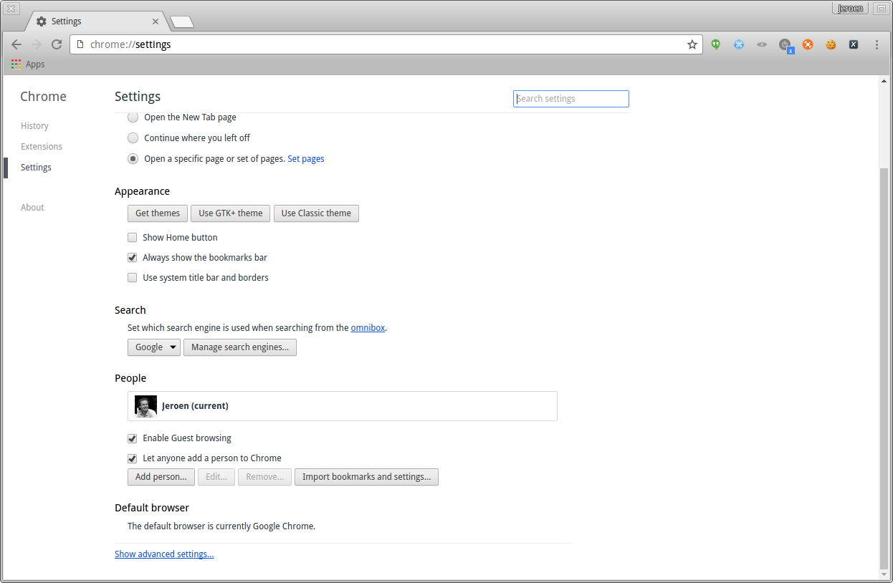

    Chrome open settings page

Go to the advanced settings page, and click on the certificates view.

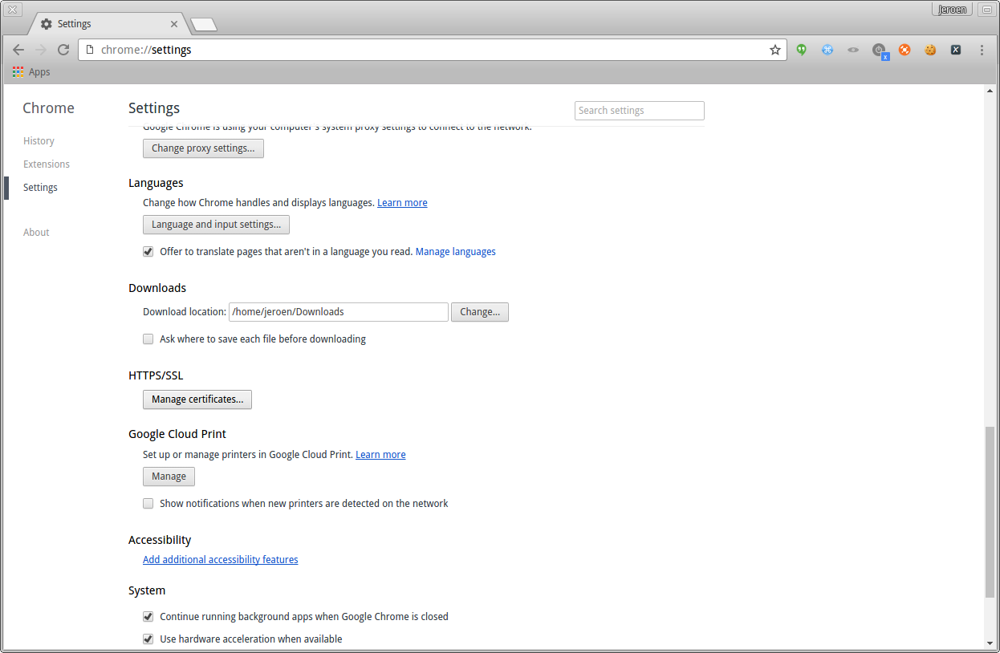

    Chrome click on advanced settings and go to certificates

Within the certificates, you need to add the certificate as an authority. Go to the right tab and click the import button.

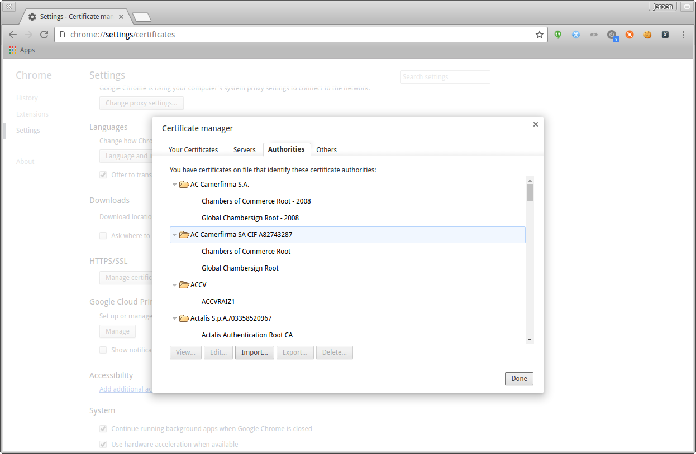

    Chrome click on authorities and press import button

Select the root certificate as generated by BounCA.

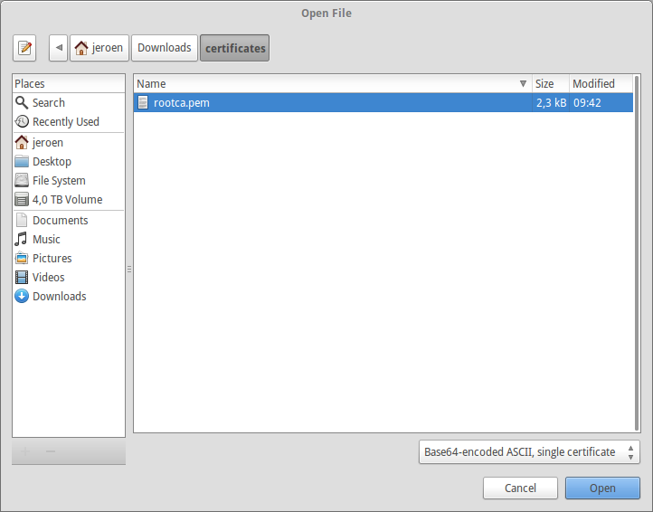

    Chrome select the root certificate file

Add the certificate and select the trust levels of it.

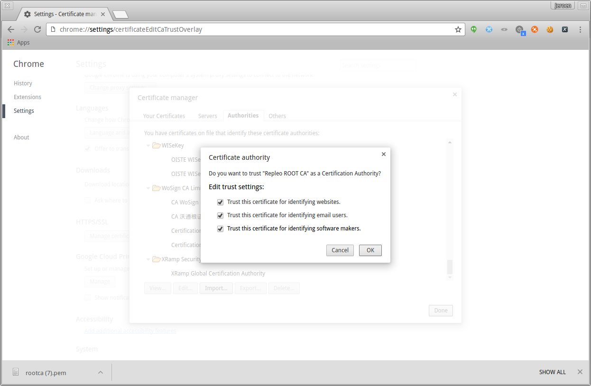

    Chrome add the certificate and select trust rules

After clicking **OK**, you will notice the root authority has been added to the authorities list. This means that all certificates signed by this root CA or its intermediate authorities are trusted by Chrome.

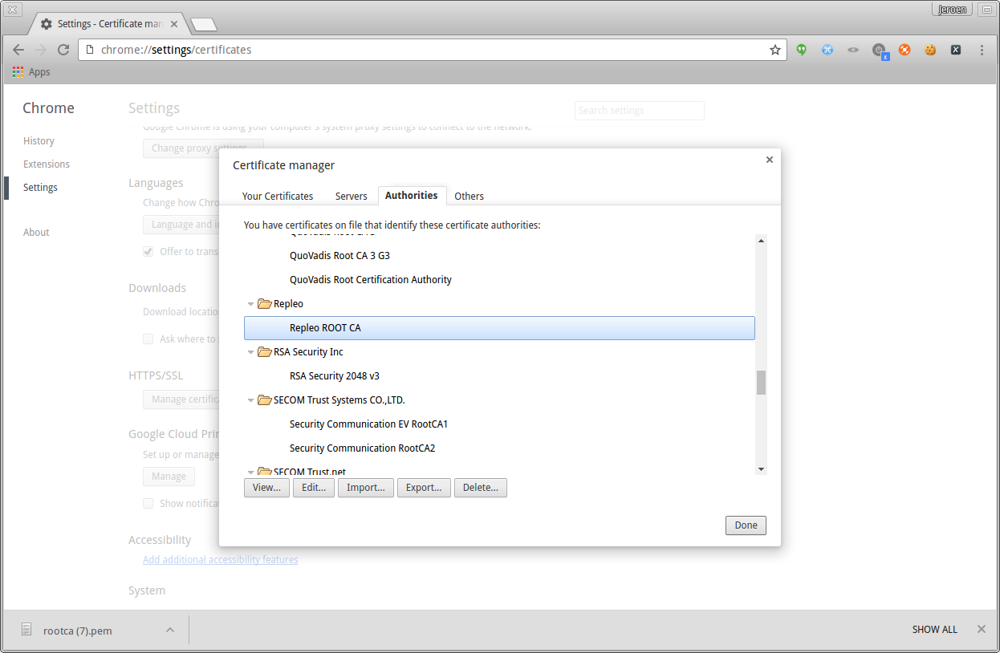

    Chrome certificate is added to authorities list

You may inspect the certificate by pressing the view button, and check if this is the trusted certificate. In case you don't trust the certificate you can also delete it again.

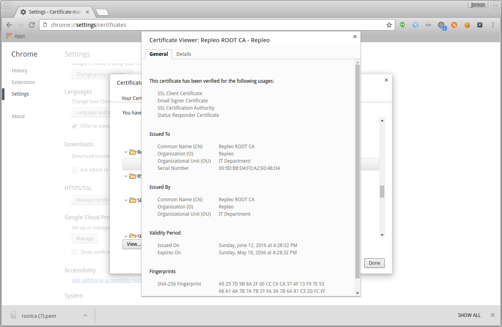

    Chrome inspect the certificate by clicking on the view button

The installation is sucessfull. When you visit a website using server certificates signed by the private root authority, you will see it has a green lock and the connection is trusted.

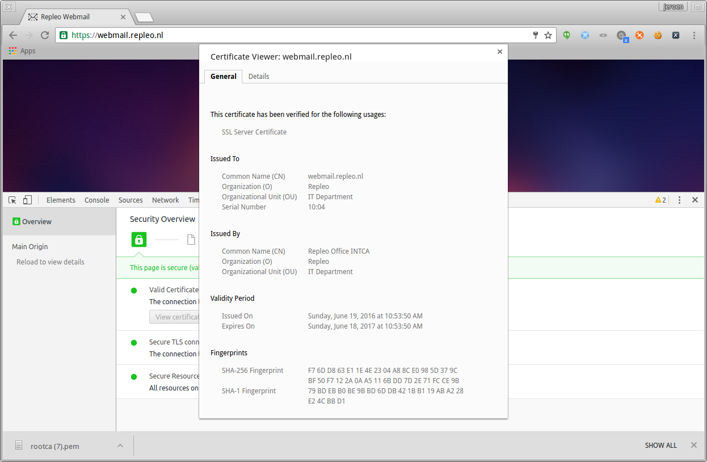

    Chrome visit self-signed website and verify it is trusted


.. _browser_firefox:

Firefox
~~~~~~~

Firefox manages its own trusted certificate list, so you always need to add the root authority certificate to the browser even if you have installed it system wide.
To add the certificate to Firefox execute the following steps.

Open Firefox and go to the settings page.

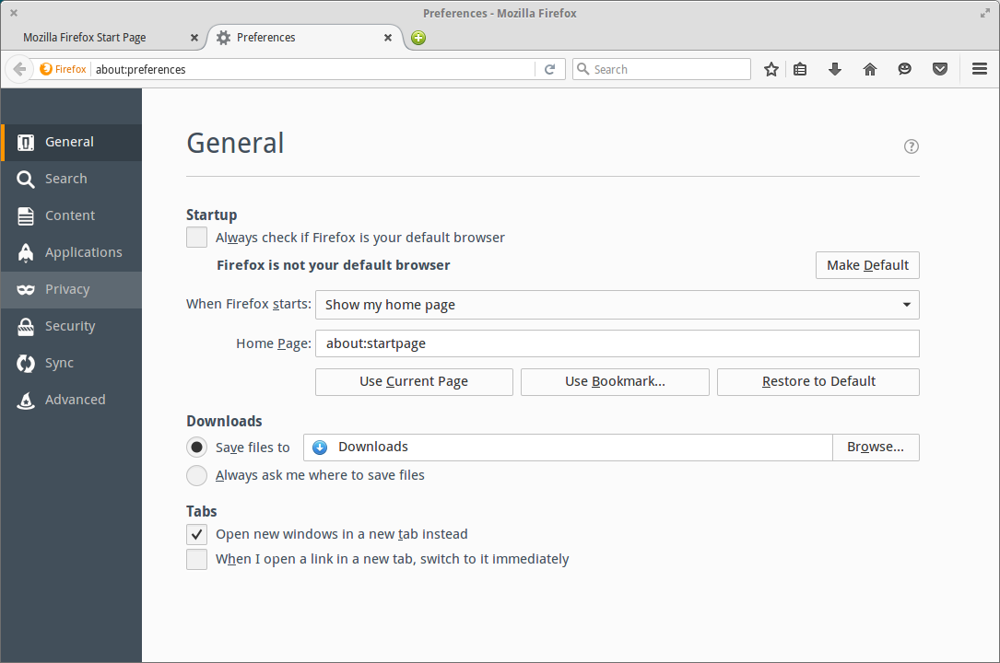

    Firefox open settings page

Go to the advanced settings page, and click on the certificates view.

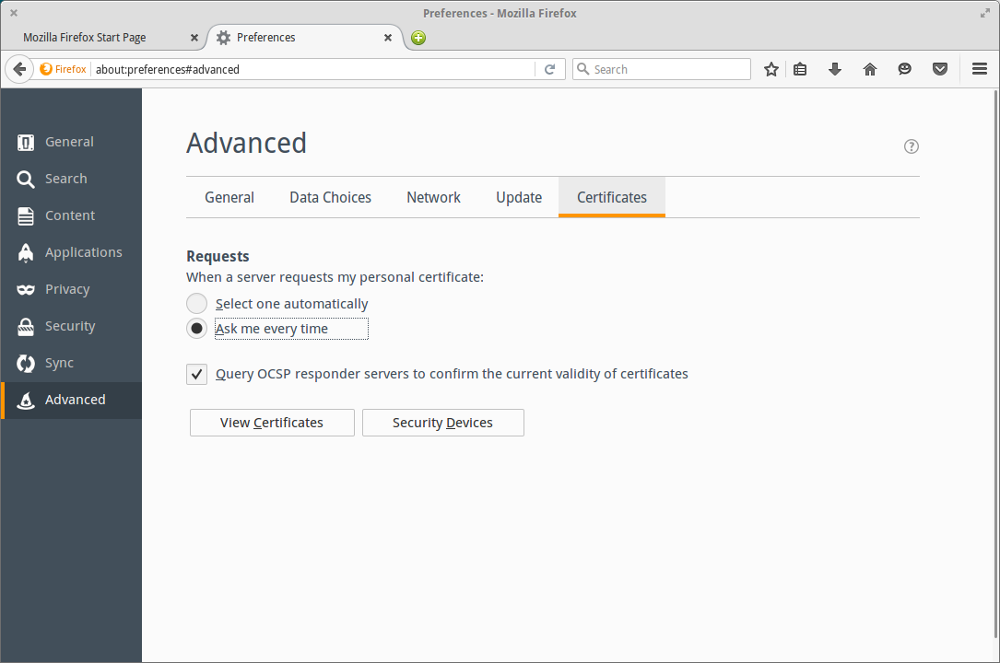

    Firefox click on advanced settings and go to certificates view

Within the certificates, you need to add the certificate as an authority. Go to the right tab and click the import button.

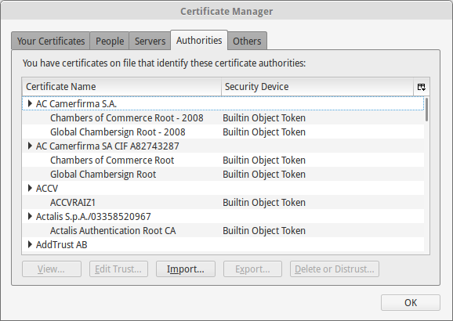

    Firefox import the root certificate

Select the root certificate as generated by BounCA.

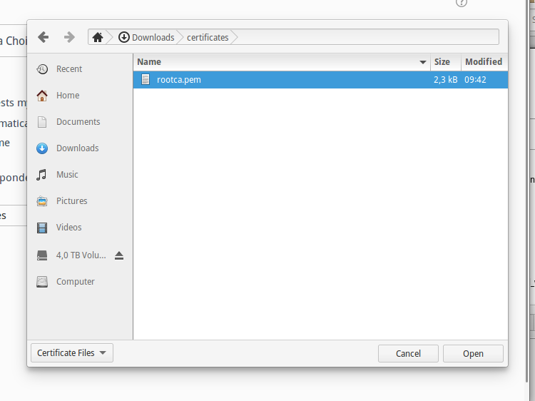

    Firefox select the root certificate file

Add the certificate and select the trust levels of it.

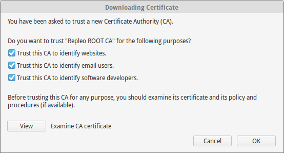

    Firefox select trust rules

After clicking **OK**, you will notice the root authority has been added to the authorities list. This means that all certificates signed by this root CA or its intermediate authorities are trusted by Chrome.

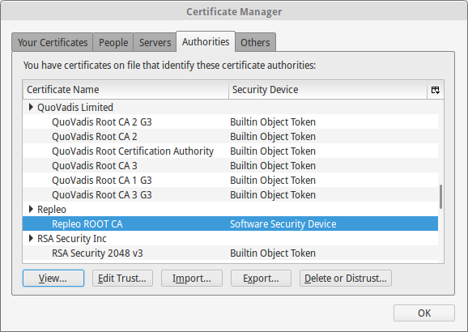

    Firefox certificate is added to authorities list

You may inspect the certificate by pressing the view button, and check if this is the trusted certificate. In case you don't trust the certificate you can also delete it again.

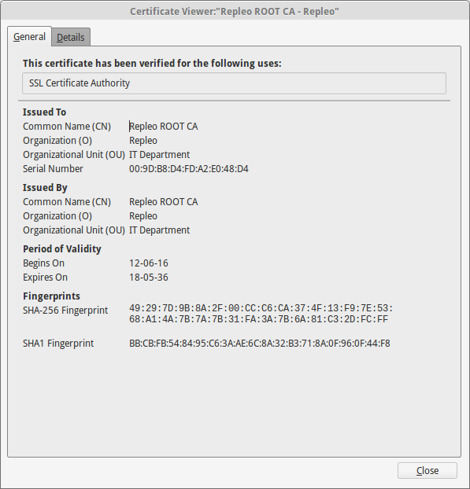

    Firefox inspect the certificate by clicking on the view button

The installation is sucessfull. When you visit a website using server certificates signed by the private root authority, you will see it has a green lock and the connection is trusted.

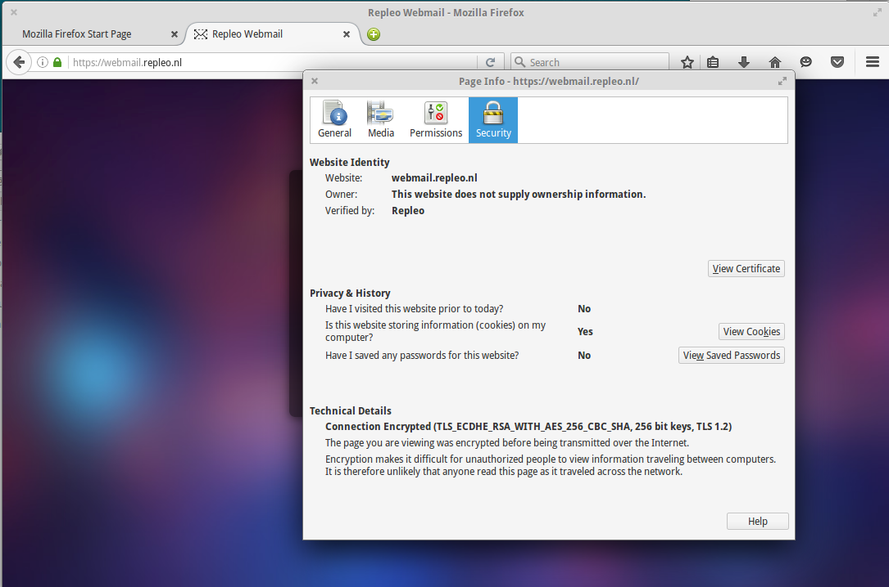

    Firefox visit self-signed website and verify it is trusted


.. _linux_ubuntu_debian:

Linux Ubuntu/Debian
~~~~~~~~~~~~~~~~~~~

Ubuntu/Debian allows you to install extra root certificates via the ``/usr/local/share/ca-certificates`` directory.
To install your own root authority certificate copy your root certificate to ``/usr/local/share/ca-certificates``. Make sure the file has the ``.crt`` extension. so rename it when necessary.

After you copied your certificate to the ``/usr/local/share/ca-certificates`` folder you need to refresh the installed certificates and hashes. Within ubuntu/debian you can perform this action via one command:

.. code-block:: shell

   sudo update-ca-certificates

You will notice that the command reports it has installed one (or more) new certificate. The certificate has been added to the Operating System and signed certificates will be trusted.

To remove the certificate, just remove it from ``/usr/local/share/ca-certificates`` and run

.. code-block:: shell

   sudo update-ca-certificates --fresh

.. _linux_redhat_centos:

Linux Red Hat / CentOS
~~~~~~~~~~~~~~~~~~~~~~

The installation of a root certificate on Red Hat or CentOS depends on the release. We discuss release 6 and 5 in this section
Red Hat and CentOS

Red Hat / CentOS 6
``````````````````

To manage certificates in CentOS 6 you need the ``ca-certificates`` package. Install this package by the following command

.. code-block:: shell

   yum install ca-certificates


Enable the dynamic CA configuration feature:

.. code-block:: shell

   update-ca-trust force-enable

Make sure the root certificate has the ``.crt`` extension and copy it to ``/etc/pki/ca-trust/source/anchors/``

.. code-block:: shell

   cp rootca.crt /etc/pki/ca-trust/source/anchors/

Update the trusted certificate list

.. code-block:: shell

   update-ca-trust extract


Red Hat / CentOS 5
``````````````````

The older CentOS releases don't offer a certificate manager. To install a new root certificate, you need to add the certificate to a trusted bundle file.

.. code-block:: shell

   cat rootca.crt >> /etc/pki/tls/certs/ca-bundle.crt


.. _freebsd:

FreeBSD
~~~~~~~

FreeBSD doesn't offer a centralized root certificate manager.
If you want to add a root authority you can add it directly to the certificates managed by OpenSSL.
This depends on your configuration and is for now out of the scope of this guide.


.. _java:

Java
~~~~

The JVM has it own root certificate store independent of the operating system.
We show how you can add the root certificate to the JVM, as option when running a Java program,
or to the generic keystore.

First, get the root certificate. We download our certicate from our `Repleo CA`_. Create a keystore
with the ``keytool`` command provided by the JDK. You must provide a password, the default one is ``changeit``.


.. code-block:: none

    # keytool -import -trustcacerts -alias root -file RepleoRoot.root.pem -keystore repleo.jks
    Enter keystore password:
    Re-enter new password:
    Owner: EMAILADDRESS=ca@repleo.nl, CN=Repleo CA, OU=HQ, O=Repleo, L=Amsterdam, ST=Noord Holland, C=NL
    Issuer: EMAILADDRESS=ca@repleo.nl, CN=Repleo CA, OU=HQ, O=Repleo, L=Amsterdam, ST=Noord Holland, C=NL
    Serial number: 978e1982d8504ede928ab36078f7ca62
    Valid from: Sat Jan 01 01:00:00 CET 2022 until: Sun Jan 01 01:00:00 CET 2040
    Certificate fingerprints:
         SHA1: 4F:EF:A6:7F:24:83:35:E1:0C:E4:15:AA:0F:68:11:0B:AC:ED:E1:61
         SHA256: 6D:2D:D6:3B:DF:1F:20:71:8B:C9:28:2F:13:BC:C5:B7:A8:69:8C:30:8F:43:B1:A9:B8:9D:2F:F6:6A:43:9D:2A
    Signature algorithm name: SHA256withRSA
    Subject Public Key Algorithm: 4096-bit RSA key
    Version: 3

    Extensions:

    #1: ObjectId: 2.5.29.35 Criticality=false
    AuthorityKeyIdentifier [
    KeyIdentifier [
    0000: BE 5E 55 2B 28 B6 18 02   CE A1 49 43 0F 73 41 A2  .^U+(.....IC.sA.
    0010: 6C 6B 89 09                                        lk..
    ]
    ]

    #2: ObjectId: 2.5.29.19 Criticality=true
    BasicConstraints:[
      CA:true
      PathLen:2147483647
    ]

    #3: ObjectId: 2.5.29.15 Criticality=true
    KeyUsage [
      DigitalSignature
      Key_CertSign
      Crl_Sign
    ]

    #4: ObjectId: 2.5.29.14 Criticality=false
    SubjectKeyIdentifier [
    KeyIdentifier [
    0000: BE 5E 55 2B 28 B6 18 02   CE A1 49 43 0F 73 41 A2  .^U+(.....IC.sA.
    0010: 6C 6B 89 09                                        lk..
    ]
    ]

    Trust this certificate? [no]:  yes
    Certificate was added to keystore


You can test the JKS with the following Java HTTPS client programm:

.. code-block:: java

    import java.net.*;
    import javax.net.*;
    import javax.net.ssl.*;
    import java.io.*;

    public class HtppSSLTestClient {

        public static void main(String args[]) throws Exception {
            String host = "ca.repleo.nl";
            int port = 443;
            SocketFactory factory = SSLSocketFactory.getDefault();
            try (Socket connection = factory.createSocket(host, port)) {
                SSLSocket ssl = (SSLSocket) connection;

                SSLParameters sslParams = new SSLParameters();
                sslParams.setEndpointIdentificationAlgorithm("HTTPS");
                ssl.setSSLParameters(sslParams);

                PrintWriter wtr = new PrintWriter(connection.getOutputStream());
                wtr.println("GET / HTTP/1.1");
                wtr.println("Host: " + host);
                wtr.println("");
                wtr.flush();

                BufferedReader input =
                    new BufferedReader(new InputStreamReader(connection.getInputStream()));
                String message = input.readLine();
                System.out.println("Got the message: " + message);
            }
        }
    }

Compile the program, and run it:

.. code-block:: none

    # javac HtppSSLTestClient.java
    # java HtppSSLTestClient
    Exception in thread "main" javax.net.ssl.SSLHandshakeException: PKIX path building failed: sun.security.provider.certpath.SunCertPathBuilderException: unable to find valid certification path to requested target
        at java.base/sun.security.ssl.Alert.createSSLException(Alert.java:131)
        at java.base/sun.security.ssl.TransportContext.fatal(TransportContext.java:325)
        at java.base/sun.security.ssl.TransportContext.fatal(TransportContext.java:268)
        at java.base/sun.security.ssl.TransportContext.fatal(TransportContext.java:263)
        at java.base/sun.security.ssl.CertificateMessage$T13CertificateConsumer.checkServerCerts(CertificateMessage.java:1340)
        ... more

You get an error as the host is not trusted. The Java Keystore needs to be added to the JVM truststore. You need to provide the
parameter ``javax.net.ssl.trustStore`` and ``javax.net.ssl.trustStorePassword``.

.. code-block:: none

    # java -Djavax.net.ssl.trustStore=repleo.jks -Djavax.net.ssl.trustStorePassword=changeit HtppSSLTestClient
    Got the message: HTTP/1.1 200 OK

When successful, you see the expected 200 OK answer.
The root certificate can also be added to the truststore of the JVM. Below the command to add the root certificate to the JVM on MacOS.
The password of the cacerts keystore is ``changeit``.

.. code-block:: none

    # /usr/libexec/java_home
    /Library/Java/JavaVirtualMachines/jdk-14.0.2.jdk/Contents/Home
    # export JAVA_HOME=/Library/Java/JavaVirtualMachines/jdk-14.0.2.jdk/Contents/Home
    # sudo keytool -import -trustcacerts -file RepleoRoot.root.pem -alias repleoca -keystore $JAVA_HOME/lib/security/cacerts
    Password:
    Warning: use -cacerts option to access cacerts keystore
    Enter keystore password:
    Owner: EMAILADDRESS=ca@repleo.nl, CN=Repleo CA, OU=HQ, O=Repleo, L=Amsterdam, ST=Noord Holland, C=NL
    Issuer: EMAILADDRESS=ca@repleo.nl, CN=Repleo CA, OU=HQ, O=Repleo, L=Amsterdam, ST=Noord Holland, C=NL
    Serial number: 978e1982d8504ede928ab36078f7ca62
    Valid from: Sat Jan 01 01:00:00 CET 2022 until: Sun Jan 01 01:00:00 CET 2040
    Certificate fingerprints:
         SHA1: 4F:EF:A6:7F:24:83:35:E1:0C:E4:15:AA:0F:68:11:0B:AC:ED:E1:61
         SHA256: 6D:2D:D6:3B:DF:1F:20:71:8B:C9:28:2F:13:BC:C5:B7:A8:69:8C:30:8F:43:B1:A9:B8:9D:2F:F6:6A:43:9D:2A
    Signature algorithm name: SHA256withRSA
    Subject Public Key Algorithm: 4096-bit RSA key
    Version: 3

    Extensions:

    #1: ObjectId: 2.5.29.35 Criticality=false
    AuthorityKeyIdentifier [
    KeyIdentifier [
    0000: BE 5E 55 2B 28 B6 18 02   CE A1 49 43 0F 73 41 A2  .^U+(.....IC.sA.
    0010: 6C 6B 89 09                                        lk..
    ]
    ]

    #2: ObjectId: 2.5.29.19 Criticality=true
    BasicConstraints:[
      CA:true
      PathLen:2147483647
    ]

    #3: ObjectId: 2.5.29.15 Criticality=true
    KeyUsage [
      DigitalSignature
      Key_CertSign
      Crl_Sign
    ]

    #4: ObjectId: 2.5.29.14 Criticality=false
    SubjectKeyIdentifier [
    KeyIdentifier [
    0000: BE 5E 55 2B 28 B6 18 02   CE A1 49 43 0F 73 41 A2  .^U+(.....IC.sA.
    0010: 6C 6B 89 09                                        lk..
    ]
    ]

    Trust this certificate? [no]:  yes
    Certificate was added to keystore
    # java HtppSSLTestClient
    Got the message: HTTP/1.1 200 OK


.. _Repleo CA: https://ca.repleo.nl/


